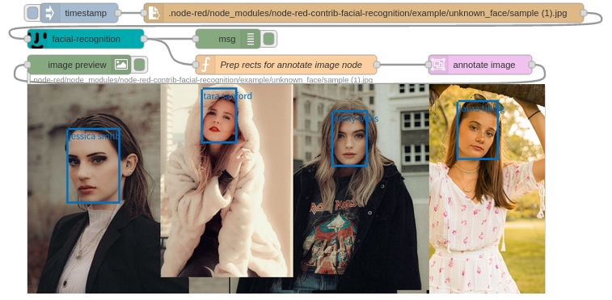
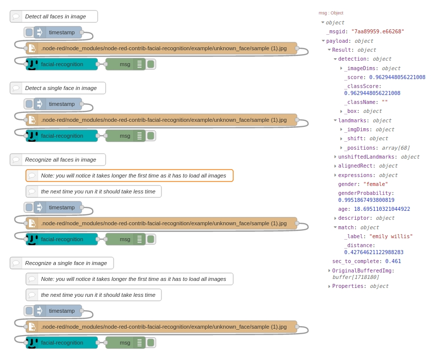
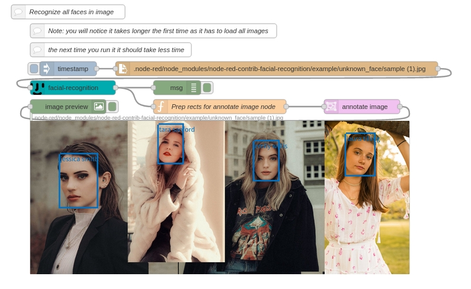
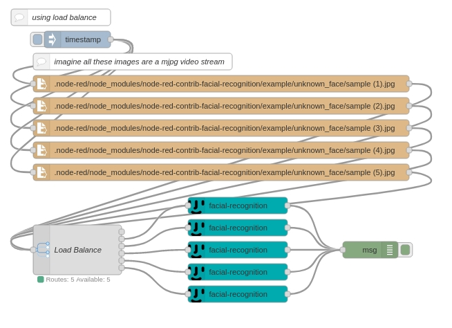
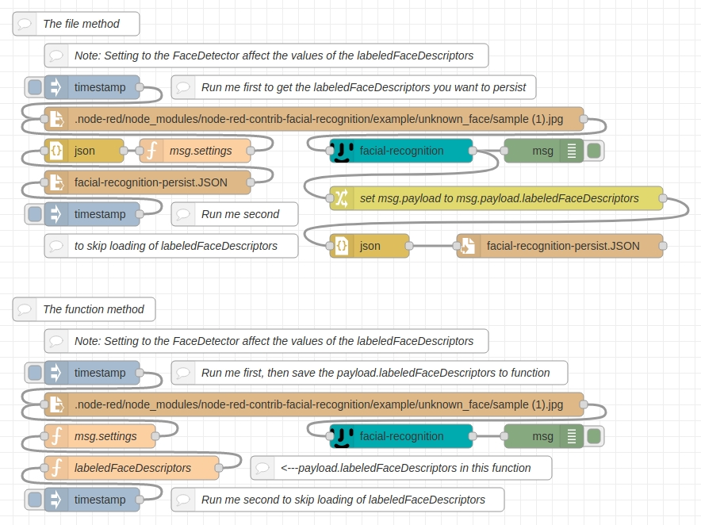

node-red-contrib-facial-recognition
===================================


<a href="http://nodered.org" target="_new">Node-RED</a> - Provides a node-red node for Facial Detection & Facial Recognition.



---

## Table of Contents
* [Install](#install)
* [About](#About)
* [Usage](#usage)
* [Node_Properties](#Node_Properties)
  * [Name](#Name)
  * [Image](#Image)
  * [Settings](#Settings)
  * [Bindings](#Bindings)
  * [FaceDetector](#FaceDetector)
  * [FaceRecognition](#FaceRecognition)
* [Example_Flows](#Example_Flows)
* [Heavy_image_processing_or_mjpeg_video_stream](#Heavy_image_processing_or_mjpeg_video_stream)
* [FaceRecognition_Persistant_labeledFaceDescriptors](#FaceRecognition_Persistant_labeledFaceDescriptors)
* [Bugs_Feature_request](#Bugs_Feature_request)
* [License](#license)
* [Work](#work)
* [Contributor](#Contributor)

---

## Install

Install with node-red Palette Manager or,

Run the following command in your Node-RED user directory - typically `~/.node-red`:

```
node-red-contrib-facial-recognition
```

---

## About

At its core it uses [@vladmandic/face-api](https://www.npmjs.com/package/@vladmandic/face-api) and [@tensorflow/tfjs-node ver.2.7.x](https://www.npmjs.com/package/@tensorflow/tfjs-node) and it can use @tensorflow/tfjs-node-gpu for the CUDA crazy amongst you.

vladmandic was a big help for us nodejs guys. After finding a bug and fielding questions, he took the time to make a nodejs build specific to tfjs-node. If you like this node-red-contrib-facial-recognition, I highly recommend you take the time to goto vladmandic's github page [https://github.com/vladmandic/face-api](https://github.com/vladmandic/face-api) and throw his repo a star.

---

## Usage

Takes a buffered image and runs TensorFlow Facial Detection and/or Facial Recognition to Detect:<br>
> - Faces in an image
> - Facial landmarks
> - Compute Face Descriptors
> - Face Expressions
> - Age & Gender Recognition
> - Face Recognition by Matching Descriptors

---

## Node_Properties

### Name

Define the msg name if you wish to change the name displayed on the node.

### Image

You can change the msg property value that you send a buffered image of your choice to.<br>Example: msg.NameOfYourChoice

### Settings
This is optional, you do not have to send it anything. Used to override settings in the nodes config Properties menu.

You can change the msg property value that you send an object of your choice to.<br>
Example: msg.NameOfYourChoice

Sending a object to this msg property value will override any settings in the nodes config Properties menu. Great for using input messages to change settings on the fly.<br>
Please see/inport the example Flow section of this documentation for better understanding.<br>
Example:
```JS
msg.settings = {
  FaceDetector :
  {
    SsdMobilenetv1 :
    {
      maxResults : 4,
      minConfidence : 0.6
    }
  },
  Tasks :
  {
    detectAllFaces :
    {
      withFaceLandmarks : true,
      withFaceExpressions : true,
      withAgeAndGender : true,
      withFaceDescriptors : true
    }
  },
  FaceRecognition :
  {
    enabled :
    {
      KnownFacesPath : "/example/known_face",
      distanceThreshold : 0.6,
      ReInitializeFaceMatcher : false
    }
  }            
};
return msg;
```
You do not have to fill out every option. You can omit any object key and its value. This node will then use the settings found in the nodes config Properties menu for that omitted object key and its value.

<b>Note: ReInitializeFaceMatcher</b><br>
Set this value to <b>true</b> if you have changed/edited/added images or image folders to your KnownFacesPath to ReInitialize the FaceMatcher. Used to process all the images into Labeled Face Descriptors for each dir name and individual descriptions for images. Do not leave set to true! it takes significant time to process. Once its ran after you have made changes to images or image folder it is saved to context and used for Facial Recognition.

Else you can just re-deploy node-red and ReInitializeFaceMatcher will run one time only on the first image you send.

### Bindings

By default it is set to <b>CPU - @tensorflow/tfjs-node</b>, this will use your CPU to process images. However you may choose to install [@tensorflow/tfjs-node-gpu](https://www.npmjs.com/package/@tensorflow/tfjs-node) to utilize your video card to process images. This is not an easy process to get CUDA working. However if you go down this rabbit hole the benefits in time to process images are significant.

Good luck.

### FaceDetector

<b>SsdMobilenetv1</b> - A Single Shot Multibox Detector; based on MobileNetV1.<br>
Computes the locations of each face in an image and returns the bounding boxes with it's probability for each face. High accuracy in detecting face bounding boxes at the cost of time to compute.<br>
> - maxResults - The max number of faces to return<br>
> - minConfidence - returns results for face(s) in a image above Confidence threshold

<b>tinyFaceDetector</b> - a fast realtime face detector, and less resource consuming compared to the SSD Mobilenet V1 face detector. It is poor at detecting small faces. Best face detector on resource limited devices.<br>
> - inputSize - size at which image is processed, the smaller the faster, <b>number must be divisible by 32</b>. Common sizes are 128, 160, 224, 320, 416, 512, 608<br>
> - scoreThreshold - returns results for face(s) in a image above Confidence threshold

### Tasks

<b>detectAllFaces</b> - Utilize the selected FaceDetector to detect multiple faces in a buffered image sent in message by user<br>
<b>detectSingleFace</b> - Utilize the selected FaceDetector to detect a single face in a buffered image sent in message by user. If image contains multiple faces it will only detect one of them, hopefully the highest probability one.<br>
> - withFaceLandmarks - computes landmarks for each detected face(s)<br>
> - withFaceExpressions - recognize face expressions of each face(s)<br>
> - withAgeAndGender - estimate age and recognize gender of each face(s)<br>
> - withFaceDescriptor - computes the face descriptors for each face(s)<br>

### FaceRecognition

<b>disabled</b> - Don't use any facial recognition<br>
<b>enabled</b> - Performs face recognition, by comparing reference face descriptor(s) to determine the similarity to query face descriptor(s).<br>
Note: FaceDetector minConfidence Properties affect the labeledFaceDescriptors. If you have a minConfidence of .9 you may miss a bunch of faces when building your labeledFaceDescriptors. after you run the node once or supply it a labeledFaceDescriptors from a persistant storage you can set the value to any level you wish for screening the input image you send<br>
> - KnownFacesPath - The location of the main folder that contains all subfolders, labeled with persons name. Subfolders should contain close-up face images of the individual. The actual name if the file in this folder does not matter. Please look at the structure of the example folder for more understanding. The name of the subfolder is what is used to label the faces for facial recognition.<br>
<b>Note: If you have changed/edited/added images or image folders to your KnownFacesPath you must redeploy the node to ReInitialize the FaceMatcher.</b> On the first image you send, FaceMatcher is ran to process all the images into Labeled Face Descriptors for each dir name and individual descriptions for images. Then it is saved to context and used for Facial Recognition for all future images you send in a message. <br>
> - distanceThreshold - returns results based on measures of how far away, Euclidean distance of face descriptor, the user submitted image is compared to how far away, Euclidean distance of face descriptors, it is to all the faces found in the labeled subfolder that are above the distanceThreshold. <b>Simply put: return names for person if it is this distanceThreshold of confidence.</b> The lower the distanceThreshold is the more likely you are to get a incorrect match. The higher the distanceThreshold is the more likely it is that a person will not be recognized.

---

## Example_Flows

<b>BASIC:</b>



```
[{"id":"461f9a48.bcb9dc","type":"tab","label":"basic - face","disabled":false,"info":""},{"id":"253c371.ef72948","type":"inject","z":"461f9a48.bcb9dc","name":"","props":[{"p":"payload"}],"repeat":"","crontab":"","once":false,"onceDelay":0.1,"topic":"","payload":"","payloadType":"date","x":160,"y":100,"wires":[["780b7c48.705bb4"]]},{"id":"780b7c48.705bb4","type":"file in","z":"461f9a48.bcb9dc","name":"","filename":".node-red/node_modules/node-red-contrib-facial-recognition/example/unknown_face/sample (1).jpg","format":"","chunk":false,"sendError":false,"encoding":"none","x":420,"y":140,"wires":[["723b347d.de38c4"]]},{"id":"ce4c6bba.732628","type":"debug","z":"461f9a48.bcb9dc","name":"","active":true,"tosidebar":true,"console":false,"tostatus":false,"complete":"true","targetType":"full","statusVal":"","statusType":"auto","x":330,"y":180,"wires":[]},{"id":"723b347d.de38c4","type":"facial-recognition","z":"461f9a48.bcb9dc","image":"payload","settings":"settings","name":"","bindings":"CPU","FaceDetector":"SsdMobilenetv1","FaceDetector_SsdMobilenetv1_maxResults":3,"FaceDetector_SsdMobilenetv1_minConfidence":"0.6","FaceDetector_tinyFaceDetector_inputSize":"416","FaceDetector_tinyFaceDetector_scoreThreshold":".4","Tasks":"detectAllFaces","FaceLandmarks":true,"FaceExpressions":true,"AgeAndGender":true,"FaceDescriptors":true,"Face_Recognition":"Face_Recognition_disabled","Face_Recognition_enabled_path":"/example/labeled_face","Face_Recognition_distanceThreshold":0.7,"x":170,"y":180,"wires":[["ce4c6bba.732628"]]},{"id":"e8f9b7f9.d068c","type":"comment","z":"461f9a48.bcb9dc","name":"Detect all faces in image","info":"","x":150,"y":60,"wires":[]},{"id":"8dfa5c87.07ff88","type":"inject","z":"461f9a48.bcb9dc","name":"","props":[{"p":"payload"}],"repeat":"","crontab":"","once":false,"onceDelay":0.1,"topic":"","payload":"","payloadType":"date","x":160,"y":280,"wires":[["436bc2a1.d01c0c"]]},{"id":"436bc2a1.d01c0c","type":"file in","z":"461f9a48.bcb9dc","name":"","filename":".node-red/node_modules/node-red-contrib-facial-recognition/example/unknown_face/sample (1).jpg","format":"","chunk":false,"sendError":false,"encoding":"none","x":420,"y":320,"wires":[["9141c2c6.98d8"]]},{"id":"e60e1e9a.162488","type":"debug","z":"461f9a48.bcb9dc","name":"","active":true,"tosidebar":true,"console":false,"tostatus":false,"complete":"true","targetType":"full","statusVal":"","statusType":"auto","x":330,"y":360,"wires":[]},{"id":"9141c2c6.98d8","type":"facial-recognition","z":"461f9a48.bcb9dc","image":"payload","settings":"settings","name":"","bindings":"CPU","FaceDetector":"SsdMobilenetv1","FaceDetector_SsdMobilenetv1_maxResults":3,"FaceDetector_SsdMobilenetv1_minConfidence":"0.6","FaceDetector_tinyFaceDetector_inputSize":"416","FaceDetector_tinyFaceDetector_scoreThreshold":".4","Tasks":"detectSingleFace","FaceLandmarks":true,"FaceExpressions":true,"AgeAndGender":true,"FaceDescriptors":true,"Face_Recognition":"Face_Recognition_disabled","Face_Recognition_enabled_path":"/example/labeled_face","Face_Recognition_distanceThreshold":0.7,"x":170,"y":360,"wires":[["e60e1e9a.162488"]]},{"id":"78c855b8.487054","type":"comment","z":"461f9a48.bcb9dc","name":"Detect a single face in image","info":"","x":160,"y":240,"wires":[]},{"id":"89e26069.bd2b28","type":"inject","z":"461f9a48.bcb9dc","name":"","props":[{"p":"payload"}],"repeat":"","crontab":"","once":false,"onceDelay":0.1,"topic":"","payload":"","payloadType":"date","x":160,"y":800,"wires":[["f11f6aa8.b70e28"]]},{"id":"f11f6aa8.b70e28","type":"file in","z":"461f9a48.bcb9dc","name":"","filename":".node-red/node_modules/node-red-contrib-facial-recognition/example/unknown_face/sample (1).jpg","format":"","chunk":false,"sendError":false,"encoding":"none","x":420,"y":840,"wires":[["a5c2774c.45ee18"]]},{"id":"b2275b16.4bf098","type":"debug","z":"461f9a48.bcb9dc","name":"","active":true,"tosidebar":true,"console":false,"tostatus":false,"complete":"true","targetType":"full","statusVal":"","statusType":"auto","x":330,"y":880,"wires":[]},{"id":"a5c2774c.45ee18","type":"facial-recognition","z":"461f9a48.bcb9dc","image":"payload","settings":"settings","name":"","bindings":"CPU","FaceDetector":"SsdMobilenetv1","FaceDetector_SsdMobilenetv1_maxResults":3,"FaceDetector_SsdMobilenetv1_minConfidence":"0.6","FaceDetector_tinyFaceDetector_inputSize":"416","FaceDetector_tinyFaceDetector_scoreThreshold":".4","Tasks":"detectSingleFace","FaceLandmarks":true,"FaceExpressions":true,"AgeAndGender":true,"FaceDescriptors":true,"Face_Recognition":"Face_Recognition_enabled","Face_Recognition_enabled_path":"/example/labeled_face","Face_Recognition_distanceThreshold":0.7,"x":170,"y":880,"wires":[["b2275b16.4bf098"]]},{"id":"a61a85b5.9ca8a8","type":"comment","z":"461f9a48.bcb9dc","name":"Recognize a single face in image","info":"","x":170,"y":680,"wires":[]},{"id":"6014abc6.1b1e44","type":"inject","z":"461f9a48.bcb9dc","name":"","props":[{"p":"payload"}],"repeat":"","crontab":"","once":false,"onceDelay":0.1,"topic":"","payload":"","payloadType":"date","x":160,"y":540,"wires":[["9fdd93b3.5bae78"]]},{"id":"9fdd93b3.5bae78","type":"file in","z":"461f9a48.bcb9dc","name":"","filename":".node-red/node_modules/node-red-contrib-facial-recognition/example/unknown_face/sample (1).jpg","format":"","chunk":false,"sendError":false,"encoding":"none","x":420,"y":580,"wires":[["674fa2c4.b218a4"]]},{"id":"9e1ff55a.983518","type":"debug","z":"461f9a48.bcb9dc","name":"","active":true,"tosidebar":true,"console":false,"tostatus":false,"complete":"true","targetType":"full","statusVal":"","statusType":"auto","x":330,"y":620,"wires":[]},{"id":"674fa2c4.b218a4","type":"facial-recognition","z":"461f9a48.bcb9dc","image":"payload","settings":"settings","name":"","bindings":"CPU","FaceDetector":"SsdMobilenetv1","FaceDetector_SsdMobilenetv1_maxResults":3,"FaceDetector_SsdMobilenetv1_minConfidence":"0.6","FaceDetector_tinyFaceDetector_inputSize":"416","FaceDetector_tinyFaceDetector_scoreThreshold":".4","Tasks":"detectAllFaces","FaceLandmarks":true,"FaceExpressions":true,"AgeAndGender":true,"FaceDescriptors":true,"Face_Recognition":"Face_Recognition_enabled","Face_Recognition_enabled_path":"/example/labeled_face","Face_Recognition_distanceThreshold":0.7,"x":170,"y":620,"wires":[["9e1ff55a.983518"]]},{"id":"8cf4cfb4.ed002","type":"comment","z":"461f9a48.bcb9dc","name":"Recognize all faces in image","info":"","x":160,"y":420,"wires":[]},{"id":"c5fd45b7.420ca","type":"comment","z":"461f9a48.bcb9dc","name":"Note: you will notice it takes longer the first time as it has to load all images","info":"","x":340,"y":460,"wires":[]},{"id":"ef0f1da5.894ba","type":"comment","z":"461f9a48.bcb9dc","name":"the next time you run it it should take less time","info":"","x":250,"y":500,"wires":[]},{"id":"34375cfb.87a60c","type":"comment","z":"461f9a48.bcb9dc","name":"Note: you will notice it takes longer the first time as it has to load all images","info":"","x":340,"y":720,"wires":[]},{"id":"58e76f00.7b4288","type":"comment","z":"461f9a48.bcb9dc","name":"the next time you run it it should take less time","info":"","x":250,"y":760,"wires":[]}]
```

---

<b>Advanced:</b>

<b>NOTE: other node-red nodes required</b>

[node-red-node-annotate-image](https://flows.nodered.org/node/node-red-node-annotate-image)

[node-red-contrib-image-output](https://flows.nodered.org/node/node-red-contrib-image-output)




```
[{"id":"63368d69.d11d5c","type":"tab","label":"Advanced - face","disabled":false,"info":""},{"id":"bdc0b3ae.b9a248","type":"inject","z":"63368d69.d11d5c","name":"","props":[{"p":"payload"}],"repeat":"","crontab":"","once":false,"onceDelay":0.1,"topic":"","payload":"","payloadType":"date","x":180,"y":220,"wires":[["f42eabc3.f6e658"]]},{"id":"f42eabc3.f6e658","type":"file in","z":"63368d69.d11d5c","name":"","filename":".node-red/node_modules/node-red-contrib-facial-recognition/example/unknown_face/sample (1).jpg","format":"","chunk":false,"sendError":false,"encoding":"none","x":620,"y":220,"wires":[["510508cd.bc342"]]},{"id":"da4443a6.9f59d8","type":"function","z":"63368d69.d11d5c","name":"Prep rects for annotate image node","func":"//global vars\nvar the_rects;\n\n//was detectAllFaces or detectSingleFace used\n//check to see if payload.Result is an array (detectAllFaces)\nvar Result = msg.payload.Result;\nif ( Array.isArray(Result) ) {\n    // get just the rect values and place in array\n    the_rects = Result.map(x => {\n        //check for label from FaceRecognition\n        var match_label;\n        if ( x.match ) {\n            match_label = x.match._label;\n        }\n        else {\n            match_label = \"\";\n        }\n        var result = {\n            type: \"rect\",\n            x: x.detection._box._x,\n            y: x.detection._box._y,\n            w: x.detection._box._width,\n            h: x.detection._box._height,\n            label: match_label\n        }\n        return result;\n    });\n    msg.annotations = the_rects;\n}\n//else detectSingleFace was used\nelse {\n    //check for label from FaceRecognition\n        var match_label;\n        if ( Result.match ) {\n            match_label = Result.match._label;\n        }\n        else {\n            match_label = \"\";\n        }\n    the_rects = [{\n        type: \"rect\",\n        x: Result.detection._box._x,\n        y: Result.detection._box._y,\n        w: Result.detection._box._width,\n        h: Result.detection._box._height,\n        label: match_label.match._label\n    }]\n    msg.annotations = the_rects;\n}\n\n\n\n//var xx = msg.payload.Result[0].detection._box._x;\n//var yy = msg.payload.Result[0].detection._box._y;\n//var ww = msg.payload.Result[0].detection._box._width;\n//var hh = msg.payload.Result[0].detection._box._height;\n\n//msg.annotations = [ {\n//    type: \"rect\",\n//    //bbox: [ xx, yy, ww, hh],\n//    x: xx, y: yy, w: ww, h: hh,\n//    //bbox: [ 100, 100, 100, 100],\n//    label: \"Tara Sanford\"\n//}]\n\nmsg.payload = msg.payload.OriginalBufferedImg;\n\nreturn msg;\n\n","outputs":1,"noerr":0,"initialize":"","finalize":"","x":500,"y":300,"wires":[["c4b929f7.c31d78"]]},{"id":"c4b929f7.c31d78","type":"annotate-image","z":"63368d69.d11d5c","name":"","fill":"","stroke":"#0070c0","lineWidth":"20","fontSize":"48","fontColor":"#0070c0","x":800,"y":300,"wires":[["1504ab31.07575d"]]},{"id":"1504ab31.07575d","type":"image","z":"63368d69.d11d5c","name":"","width":"800","data":"payload","dataType":"msg","thumbnail":false,"active":true,"pass":false,"outputs":0,"x":180,"y":300,"wires":[]},{"id":"1bc415e3.ed6bea","type":"debug","z":"63368d69.d11d5c","name":"","active":true,"tosidebar":true,"console":false,"tostatus":false,"complete":"true","targetType":"full","statusVal":"","statusType":"auto","x":410,"y":260,"wires":[]},{"id":"510508cd.bc342","type":"facial-recognition","z":"63368d69.d11d5c","image":"payload","settings":"settings","name":"","bindings":"CPU","FaceDetector":"SsdMobilenetv1","FaceDetector_SsdMobilenetv1_maxResults":"5","FaceDetector_SsdMobilenetv1_minConfidence":"0.6","FaceDetector_tinyFaceDetector_inputSize":"416","FaceDetector_tinyFaceDetector_scoreThreshold":"0.5","Tasks":"detectAllFaces","FaceLandmarks":true,"FaceExpressions":true,"AgeAndGender":true,"FaceDescriptors":true,"Face_Recognition":"Face_Recognition_enabled","Face_Recognition_enabled_path":"/example/labeled_face","Face_Recognition_distanceThreshold":0.7,"x":190,"y":260,"wires":[["1bc415e3.ed6bea","da4443a6.9f59d8"]]},{"id":"ee417043.f6b968","type":"comment","z":"63368d69.d11d5c","name":"Recognize all faces in image","info":"","x":180,"y":100,"wires":[]},{"id":"5bc97bde.44ff3c","type":"comment","z":"63368d69.d11d5c","name":"Note: you will notice it takes longer the first time as it has to load all images","info":"","x":360,"y":140,"wires":[]},{"id":"d0d6d5db.66c4b","type":"comment","z":"63368d69.d11d5c","name":"the next time you run it it should take less time","info":"","x":270,"y":180,"wires":[]}]
```

---

## Heavy_image_processing_or_mjpeg_video_stream

Every output object message from this node has sec_to_complete with the amount of time it took to process the image.<br>
Based on your device/processing speed/CPU or CUDA will vary the amount of time it takes to process the image.

So if it takes 0.623 seconds to do a facialrecognition and your sending it 15 frames a second you will create a backlog of work and overflow the node.

The best thing to do is use multiple facial-recognition nodes to process the images as individual workers.

then check to see if it is keeping up.

Example Flow:

<b>NOTE: other node-red nodes required</b>

[node-red-node-loadbalance](https://flows.nodered.org/node/node-red-contrib-loadbalance)



```
[{"id":"97c3c9fa.50bc1","type":"tab","label":"Heavy image processing","disabled":false,"info":""},{"id":"a9703d55.c50da8","type":"file in","z":"97c3c9fa.50bc1","name":"","filename":".node-red/node_modules/node-red-contrib-facial-recognition/example/unknown_face/sample (1).jpg","format":"","chunk":false,"sendError":false,"encoding":"none","x":420,"y":180,"wires":[["b3fccdb8.e5a4c8"]]},{"id":"7f3eb574.32703c","type":"comment","z":"97c3c9fa.50bc1","name":"With out load balance","info":"","x":140,"y":60,"wires":[]},{"id":"1f0c5c85.0cffab","type":"file in","z":"97c3c9fa.50bc1","name":"","filename":".node-red/node_modules/node-red-contrib-facial-recognition/example/unknown_face/sample (2).jpg","format":"","chunk":false,"sendError":false,"encoding":"none","x":420,"y":220,"wires":[["b3fccdb8.e5a4c8"]]},{"id":"3c447a94.e1678e","type":"file in","z":"97c3c9fa.50bc1","name":"","filename":".node-red/node_modules/node-red-contrib-facial-recognition/example/unknown_face/sample (3).jpg","format":"","chunk":false,"sendError":false,"encoding":"none","x":420,"y":260,"wires":[["b3fccdb8.e5a4c8"]]},{"id":"62895aa0.7571fc","type":"file in","z":"97c3c9fa.50bc1","name":"","filename":".node-red/node_modules/node-red-contrib-facial-recognition/example/unknown_face/sample (4).jpg","format":"","chunk":false,"sendError":false,"encoding":"none","x":420,"y":300,"wires":[["b3fccdb8.e5a4c8"]]},{"id":"d8d0a0a4.f0dac","type":"file in","z":"97c3c9fa.50bc1","name":"","filename":".node-red/node_modules/node-red-contrib-facial-recognition/example/unknown_face/sample (5).jpg","format":"","chunk":false,"sendError":false,"encoding":"none","x":420,"y":340,"wires":[["b3fccdb8.e5a4c8"]]},{"id":"6c6e6a3.30c7814","type":"comment","z":"97c3c9fa.50bc1","name":"imagine all these images are a mjpg video stream","info":"","x":260,"y":140,"wires":[]},{"id":"bd1e05b6.13c8e8","type":"comment","z":"97c3c9fa.50bc1","name":"using load balance","info":"","x":150,"y":460,"wires":[]},{"id":"22ad7a58.06e9e6","type":"file in","z":"97c3c9fa.50bc1","name":"","filename":".node-red/node_modules/node-red-contrib-facial-recognition/example/unknown_face/sample (1).jpg","format":"","chunk":false,"sendError":false,"encoding":"none","x":440,"y":580,"wires":[["86af086c.50ba2"]]},{"id":"af08979a.dc12b8","type":"file in","z":"97c3c9fa.50bc1","name":"","filename":".node-red/node_modules/node-red-contrib-facial-recognition/example/unknown_face/sample (2).jpg","format":"","chunk":false,"sendError":false,"encoding":"none","x":440,"y":620,"wires":[["86af086c.50ba2"]]},{"id":"62b5fde3.d4e5b4","type":"file in","z":"97c3c9fa.50bc1","name":"","filename":".node-red/node_modules/node-red-contrib-facial-recognition/example/unknown_face/sample (3).jpg","format":"","chunk":false,"sendError":false,"encoding":"none","x":440,"y":660,"wires":[["86af086c.50ba2"]]},{"id":"e1ce11a1.066b38","type":"file in","z":"97c3c9fa.50bc1","name":"","filename":".node-red/node_modules/node-red-contrib-facial-recognition/example/unknown_face/sample (4).jpg","format":"","chunk":false,"sendError":false,"encoding":"none","x":440,"y":700,"wires":[["86af086c.50ba2"]]},{"id":"8830dbc5.a4edd","type":"file in","z":"97c3c9fa.50bc1","name":"","filename":".node-red/node_modules/node-red-contrib-facial-recognition/example/unknown_face/sample (5).jpg","format":"","chunk":false,"sendError":false,"encoding":"none","x":440,"y":740,"wires":[["86af086c.50ba2"]]},{"id":"c2d315cd.4e7ef8","type":"comment","z":"97c3c9fa.50bc1","name":"imagine all these images are a mjpg video stream","info":"","x":280,"y":540,"wires":[]},{"id":"86af086c.50ba2","type":"Load Balance","z":"97c3c9fa.50bc1","name":"","routes":"5","outputs":6,"selection":"next","noavailability":"discard","nocapacity":"admin","defaultcapacity":100,"sticky":"","dynamic":"73e6b3d7.113a9c","mps":"","x":180,"y":880,"wires":[[],["46023eb1.06714"],["399db620.ef7e4a"],["9eb0dd84.1b5a4"],["142b2637.ece30a"],["b2d5aa86.9b40d"]]},{"id":"84949984.565528","type":"inject","z":"97c3c9fa.50bc1","name":"","props":[{"p":"payload"}],"repeat":"","crontab":"","once":false,"onceDelay":0.1,"topic":"","payload":"","payloadType":"date","x":180,"y":500,"wires":[["22ad7a58.06e9e6","af08979a.dc12b8","62b5fde3.d4e5b4","e1ce11a1.066b38","8830dbc5.a4edd"]]},{"id":"73e6b3d7.113a9c","type":"inject","z":"97c3c9fa.50bc1","name":"","props":[{"p":"payload"}],"repeat":"","crontab":"","once":false,"onceDelay":0.1,"topic":"","payload":"","payloadType":"date","x":160,"y":100,"wires":[["a9703d55.c50da8","1f0c5c85.0cffab","3c447a94.e1678e","62895aa0.7571fc","d8d0a0a4.f0dac"]]},{"id":"d9539e90.8e1cd","type":"debug","z":"97c3c9fa.50bc1","name":"","active":true,"tosidebar":true,"console":false,"tostatus":false,"complete":"true","targetType":"full","statusVal":"","statusType":"auto","x":350,"y":380,"wires":[]},{"id":"b3fccdb8.e5a4c8","type":"facial-recognition","z":"97c3c9fa.50bc1","image":"payload","settings":"settings","name":"","bindings":"CPU","FaceDetector":"SsdMobilenetv1","FaceDetector_SsdMobilenetv1_maxResults":3,"FaceDetector_SsdMobilenetv1_minConfidence":"0.6","FaceDetector_tinyFaceDetector_inputSize":"416","FaceDetector_tinyFaceDetector_scoreThreshold":".4","Tasks":"detectAllFaces","FaceLandmarks":true,"FaceExpressions":true,"AgeAndGender":true,"FaceDescriptors":true,"Face_Recognition":"Face_Recognition_disabled","Face_Recognition_enabled_path":"/example/labeled_face","Face_Recognition_distanceThreshold":0.7,"x":170,"y":380,"wires":[["d9539e90.8e1cd"]]},{"id":"300fe892.a26758","type":"debug","z":"97c3c9fa.50bc1","name":"","active":true,"tosidebar":true,"console":false,"tostatus":false,"complete":"true","targetType":"full","statusVal":"","statusType":"auto","x":710,"y":880,"wires":[]},{"id":"46023eb1.06714","type":"facial-recognition","z":"97c3c9fa.50bc1","image":"payload","settings":"settings","name":"","bindings":"CPU","FaceDetector":"SsdMobilenetv1","FaceDetector_SsdMobilenetv1_maxResults":3,"FaceDetector_SsdMobilenetv1_minConfidence":"0.6","FaceDetector_tinyFaceDetector_inputSize":"416","FaceDetector_tinyFaceDetector_scoreThreshold":".4","Tasks":"detectAllFaces","FaceLandmarks":true,"FaceExpressions":true,"AgeAndGender":true,"FaceDescriptors":true,"Face_Recognition":"Face_Recognition_disabled","Face_Recognition_enabled_path":"/example/labeled_face","Face_Recognition_distanceThreshold":0.7,"x":470,"y":800,"wires":[["300fe892.a26758"]]},{"id":"399db620.ef7e4a","type":"facial-recognition","z":"97c3c9fa.50bc1","image":"payload","settings":"settings","name":"","bindings":"CPU","FaceDetector":"SsdMobilenetv1","FaceDetector_SsdMobilenetv1_maxResults":3,"FaceDetector_SsdMobilenetv1_minConfidence":"0.6","FaceDetector_tinyFaceDetector_inputSize":"416","FaceDetector_tinyFaceDetector_scoreThreshold":".4","Tasks":"detectAllFaces","FaceLandmarks":true,"FaceExpressions":true,"AgeAndGender":true,"FaceDescriptors":true,"Face_Recognition":"Face_Recognition_disabled","Face_Recognition_enabled_path":"/example/labeled_face","Face_Recognition_distanceThreshold":0.7,"x":470,"y":840,"wires":[["300fe892.a26758"]]},{"id":"9eb0dd84.1b5a4","type":"facial-recognition","z":"97c3c9fa.50bc1","image":"payload","settings":"settings","name":"","bindings":"CPU","FaceDetector":"SsdMobilenetv1","FaceDetector_SsdMobilenetv1_maxResults":3,"FaceDetector_SsdMobilenetv1_minConfidence":"0.6","FaceDetector_tinyFaceDetector_inputSize":"416","FaceDetector_tinyFaceDetector_scoreThreshold":".4","Tasks":"detectAllFaces","FaceLandmarks":true,"FaceExpressions":true,"AgeAndGender":true,"FaceDescriptors":true,"Face_Recognition":"Face_Recognition_disabled","Face_Recognition_enabled_path":"/example/labeled_face","Face_Recognition_distanceThreshold":0.7,"x":470,"y":880,"wires":[["300fe892.a26758"]]},{"id":"142b2637.ece30a","type":"facial-recognition","z":"97c3c9fa.50bc1","image":"payload","settings":"settings","name":"","bindings":"CPU","FaceDetector":"SsdMobilenetv1","FaceDetector_SsdMobilenetv1_maxResults":3,"FaceDetector_SsdMobilenetv1_minConfidence":"0.6","FaceDetector_tinyFaceDetector_inputSize":"416","FaceDetector_tinyFaceDetector_scoreThreshold":".4","Tasks":"detectAllFaces","FaceLandmarks":true,"FaceExpressions":true,"AgeAndGender":true,"FaceDescriptors":true,"Face_Recognition":"Face_Recognition_disabled","Face_Recognition_enabled_path":"/example/labeled_face","Face_Recognition_distanceThreshold":0.7,"x":470,"y":920,"wires":[["300fe892.a26758"]]},{"id":"b2d5aa86.9b40d","type":"facial-recognition","z":"97c3c9fa.50bc1","image":"payload","settings":"settings","name":"","bindings":"CPU","FaceDetector":"SsdMobilenetv1","FaceDetector_SsdMobilenetv1_maxResults":3,"FaceDetector_SsdMobilenetv1_minConfidence":"0.6","FaceDetector_tinyFaceDetector_inputSize":"416","FaceDetector_tinyFaceDetector_scoreThreshold":".4","Tasks":"detectAllFaces","FaceLandmarks":true,"FaceExpressions":true,"AgeAndGender":true,"FaceDescriptors":true,"Face_Recognition":"Face_Recognition_disabled","Face_Recognition_enabled_path":"/example/labeled_face","Face_Recognition_distanceThreshold":0.7,"x":470,"y":960,"wires":[["300fe892.a26758"]]}]
```

---

## FaceRecognition_Persistant_labeledFaceDescriptors

Note: FaceDetector minConfidence Properties affect the labeledFaceDescriptors. If you have a minConfidence of .9 you may miss a bunch of faces when building your labeledFaceDescriptors.

You can save the FaceRecognition labeledFaceDescriptors to persistant storage solution so you don't have to load all the images in your KnownFacesPath folder every time you deploy node red or if node-red/your device restarts.

This could be a HUGE time savings if you have thousands of people in your KnownFacesPath folder.

Also this shows how the msg.settings is used. Just un-comment anything you wish to override in the Properties menu of the node.

Example Flow:



```
[{"id":"6fb28ca.5920374","type":"tab","label":"persistant - face","disabled":false,"info":""},{"id":"d01621ea.40cb08","type":"inject","z":"6fb28ca.5920374","name":"","props":[{"p":"payload"}],"repeat":"","crontab":"","once":false,"onceDelay":0.1,"topic":"","payload":"","payloadType":"date","x":160,"y":140,"wires":[["c3bd1e6e.bf8798"]]},{"id":"c3bd1e6e.bf8798","type":"file in","z":"6fb28ca.5920374","name":"","filename":".node-red/node_modules/node-red-contrib-facial-recognition/example/unknown_face/sample (1).jpg","format":"","chunk":false,"sendError":false,"encoding":"none","x":440,"y":180,"wires":[["cf8e3656.7677e8"]]},{"id":"cf8e3656.7677e8","type":"facial-recognition","z":"6fb28ca.5920374","image":"payload","settings":"settings","name":"","bindings":"CPU","FaceDetector":"SsdMobilenetv1","FaceDetector_SsdMobilenetv1_maxResults":"4","FaceDetector_SsdMobilenetv1_minConfidence":"0.4","FaceDetector_tinyFaceDetector_inputSize":"416","FaceDetector_tinyFaceDetector_scoreThreshold":".4","Tasks":"detectAllFaces","FaceLandmarks":true,"FaceExpressions":true,"AgeAndGender":true,"FaceDescriptors":true,"Face_Recognition":"Face_Recognition_enabled","Face_Recognition_enabled_path":"/example/labeled_face","Face_Recognition_distanceThreshold":"0.7","x":550,"y":220,"wires":[["cd260561.83b6e8","fecb8468.46893"]]},{"id":"366d25af.834d4a","type":"comment","z":"6fb28ca.5920374","name":"Run me first to get the labeledFaceDescriptors you want to persist","info":"","x":490,"y":140,"wires":[]},{"id":"4ecdca5c.5158dc","type":"comment","z":"6fb28ca.5920374","name":"Note: Setting to the FaceDetector affect the values of the labeledFaceDescriptors","info":"","x":380,"y":100,"wires":[]},{"id":"50b1407f.502de8","type":"function","z":"6fb28ca.5920374","name":"msg.settings","func":"var labeledFaceDescriptors = msg.labeledFaceDescriptors;\nmsg.settings = {\n  //FaceDetector :\n  //{\n  //  SsdMobilenetv1 :\n  //  {\n  //    maxResults : 4,\n  //    minConfidence : 0.6\n  //  }\n  //},\n  //Tasks :\n  //{\n  //  detectAllFaces :\n  //  {\n  //    withFaceLandmarks : true,\n  //    withFaceExpressions : true,\n  //    withAgeAndGender : true,\n  //    withFaceDescriptors : true\n  //  }\n  //},\n  FaceRecognition :\n  {\n    enabled :\n    {\n      //KnownFacesPath : \"/example/labeled_face\",\n      //distanceThreshold : 0.6,\n      ReInitializeFaceMatcher : false,\n      labeledFaceDescriptors : labeledFaceDescriptors\n    }\n  }            \n};\nreturn msg;","outputs":1,"noerr":0,"initialize":"","finalize":"","x":170,"y":580,"wires":[["584062ed.bbcabc"]]},{"id":"d027d604.89c8c","type":"function","z":"6fb28ca.5920374","name":"labeledFaceDescriptors","func":"msg.labeledFaceDescriptors = [{\"label\":\"emily willis\",\"descriptors\":[[-0.13837632536888123,0.03715652972459793,0.11943661421537399,-0.14564058184623718,-0.14278163015842438,-0.12905479967594147,0.024591553956270218,-0.07205424457788467,0.10922642052173615,-0.13446299731731415,0.1410617083311081,0.006217941641807556,-0.15871217846870422,0.005932350642979145,-0.10339810699224472,0.20325425267219543,-0.25135645270347595,-0.19345350563526154,-0.07726305723190308,-0.06708657741546631,0.105731301009655,0.011691654101014137,-0.018943123519420624,0.1195652112364769,-0.0226505845785141,-0.2814300060272217,-0.12957565486431122,0.0047530923038721085,-0.014252103865146637,-0.0480736680328846,0.0707312673330307,0.04588581994175911,-0.2446531057357788,-0.014047851786017418,0.02516096830368042,0.06518319994211197,-0.08442901819944382,-0.11617410182952881,0.170414000749588,-0.0029783304780721664,-0.2261282205581665,-0.03142685070633888,0.15218134224414825,0.2697438597679138,0.22318552434444427,0.04346245154738426,-0.006372600793838501,-0.04441838338971138,0.1173110082745552,-0.35338112711906433,0.07229973375797272,0.19223248958587646,0.0618710070848465,0.04654160141944885,0.07784169912338257,-0.10970593988895416,0.0969948023557663,0.12409348785877228,-0.20556926727294922,0.09566214680671692,0.06316575407981873,-0.22659015655517578,-0.033999741077423096,-0.09878625720739365,0.1406192034482956,0.11493505537509918,-0.10733331739902496,-0.20399010181427002,0.24537426233291626,-0.2401348054409027,-0.10601985454559326,0.046458981931209564,-0.09801271557807922,-0.1710813045501709,-0.34948036074638367,-0.0535285510122776,0.4262668490409851,0.1985933929681778,-0.0764433741569519,0.10707207024097443,-0.05329053848981857,-0.004056977108120918,0.031415872275829315,0.19951030611991882,-0.0367661714553833,0.02153748646378517,-0.15118607878684998,0.07494175434112549,0.15654242038726807,-0.015513245016336441,-0.03918442875146866,0.262949675321579,0.021440215408802032,-0.04301685839891434,0.012713868170976639,0.048847414553165436,-0.0818215012550354,-0.011259473860263824,-0.1705746203660965,0.008102420717477798,-0.05179254710674286,-0.022192105650901794,-0.053095974028110504,0.13682562112808228,-0.12462538480758667,0.11449982225894928,-0.08391346037387848,-0.02648969739675522,-0.14329557120800018,-0.06948806345462799,-0.10749001055955887,-0.049826186150312424,0.050668537616729736,-0.17873798310756683,0.13552910089492798,0.22308741509914398,-0.0015953481197357178,0.1248166412115097,0.05762605369091034,0.06528566777706146,0.032970309257507324,-0.14899621903896332,-0.18952153623104095,-0.04314994439482689,0.0219607874751091,-0.04416688159108162,0.04744240641593933,0.06704996526241302],[-0.15356707572937012,0.009359399788081646,0.0710238665342331,-0.14033594727516174,-0.17907950282096863,-0.08573081344366074,0.020527463406324387,-0.04717480391263962,0.12871935963630676,-0.16293969750404358,0.14068585634231567,0.035580165684223175,-0.13396672904491425,0.03489186614751816,-0.10363247990608215,0.18977081775665283,-0.1935480535030365,-0.16185037791728973,-0.07396969199180603,-0.09743375331163406,0.12411920726299286,0.03145832568407059,-0.038440603762865067,0.11187334358692169,-0.043685317039489746,-0.29954904317855835,-0.10924486815929413,0.023300066590309143,-0.01703920215368271,-0.04403424263000488,0.08882098644971848,0.08798293769359589,-0.20214559137821198,0.027847297489643097,-0.001497659832239151,0.02286241017282009,-0.07061351090669632,-0.1353236883878708,0.16911521553993225,0.07158758491277695,-0.22481650114059448,-0.055694371461868286,0.11743739247322083,0.2796476483345032,0.1802855134010315,0.0399981364607811,0.040526170283555984,-0.016131877899169922,0.12306293845176697,-0.33904045820236206,0.02899046614766121,0.18789848685264587,0.020010683685541153,0.0340263806283474,0.08148695528507233,-0.13978713750839233,0.07094702124595642,0.1242978572845459,-0.19979791343212128,0.11035682260990143,0.0017410889267921448,-0.17920459806919098,-0.021549727767705917,-0.13494645059108734,0.18315058946609497,0.13668090105056763,-0.10235702246427536,-0.1738264411687851,0.2833369970321655,-0.1959768831729889,-0.10288292169570923,0.053159791976213455,-0.15422819554805756,-0.2338603287935257,-0.301632285118103,0.010384788736701012,0.4071090519428253,0.258539080619812,-0.04102502018213272,0.07271303236484528,-0.03318282216787338,0.01172306016087532,0.04051223769783974,0.20837721228599548,-0.019081290811300278,0.001051187515258789,-0.0935637429356575,0.05226371809840202,0.1858752965927124,0.010693829506635666,-0.09851093590259552,0.28136342763900757,0.029953733086586,-0.06807902455329895,-0.024258704856038094,0.0374753400683403,-0.0897519439458847,-0.011310912668704987,-0.1518237590789795,-0.012624181807041168,-0.04619475081562996,-0.04068710654973984,-0.02352302148938179,0.15843996405601501,-0.12339000403881073,0.11589634418487549,-0.10730306059122086,-0.030685540288686752,-0.16924947500228882,-0.02824147790670395,-0.11463534832000732,-0.02652614563703537,0.03366115689277649,-0.15036791563034058,0.1519363969564438,0.2372354418039322,0.0660468190908432,0.16707855463027954,0.06244990602135658,0.05227994918823242,0.054562561213970184,-0.13257765769958496,-0.14689764380455017,-0.05619988590478897,0.02771735191345215,-0.038544487208127975,0.024321794509887695,0.06217536702752113],[-0.1749677211046219,0.07361344248056412,0.08707644790410995,-0.16290564835071564,-0.13557808101177216,-0.10819248855113983,-0.01686657778918743,-0.05643795430660248,0.11298031359910965,-0.1544136255979538,0.17414778470993042,-0.032026924192905426,-0.1401340663433075,0.02730923518538475,-0.09385527670383453,0.17553609609603882,-0.25320112705230713,-0.1697951853275299,-0.04720152169466019,-0.09162678569555283,0.07818485796451569,0.02389673888683319,-0.07231605052947998,0.11545397341251373,-0.023545153439044952,-0.2582966685295105,-0.07253348082304001,0.0071870991960167885,0.06322504580020905,-0.03598127141594887,0.021393893286585808,0.015897050499916077,-0.2318727970123291,0.008456695824861526,0.024170266464352608,0.11149166524410248,-0.0644555389881134,-0.10170142352581024,0.13678929209709167,0.010525806806981564,-0.25688543915748596,-0.022332746535539627,0.11720273643732071,0.26000821590423584,0.1739593744277954,0.04729209840297699,0.0048691630363464355,-0.04585941135883331,0.12272198498249054,-0.29864567518234253,0.003788852132856846,0.23036819696426392,0.03686165064573288,0.004804275929927826,0.03381031006574631,-0.17309223115444183,0.037846215069293976,0.12526553869247437,-0.18195226788520813,0.08635742217302322,0.06262260675430298,-0.14114074409008026,-0.016144782304763794,-0.0988311618566513,0.14582929015159607,0.11155534535646439,-0.13484875857830048,-0.21758109331130981,0.22852009534835815,-0.2233627736568451,-0.07484687864780426,0.12000000476837158,-0.09176555275917053,-0.2249152660369873,-0.260353684425354,0.00033739209175109863,0.4329224228858948,0.20944692194461823,-0.023720912635326385,0.1117941290140152,-0.03786403685808182,-0.034071147441864014,0.05321173742413521,0.21112965047359467,-0.04391024634242058,0.08199384063482285,-0.13130813837051392,0.05548260733485222,0.18598754703998566,0.0065875425934791565,-0.03814395144581795,0.2094845324754715,-0.0021822303533554077,-0.02072996273636818,-0.03160705789923668,0.062998466193676,-0.12203994393348694,-0.016881518065929413,-0.15693607926368713,-0.05765766650438309,-0.030700426548719406,-0.04499708116054535,-0.05377395078539848,0.13711605966091156,-0.12835706770420074,0.12780144810676575,-0.07479865849018097,-0.02971259132027626,-0.16929839551448822,-0.018657218664884567,-0.030149061232805252,-0.012144714593887329,0.06278107315301895,-0.162788525223732,0.15407881140708923,0.2400321662425995,0.06320417672395706,0.14880406856536865,0.12108379602432251,0.009760656394064426,0.07557123154401779,-0.13335615396499634,-0.15459012985229492,-0.09267483651638031,-0.02915964461863041,-0.06500844657421112,0.08942607045173645,0.017661675810813904],[-0.11480224132537842,0.06305459141731262,0.08780305087566376,-0.0940929651260376,-0.10476763546466827,-0.10193881392478943,-0.07610955834388733,-0.09928566962480545,0.15366126596927643,-0.11247344315052032,0.15566056966781616,-0.01770719140768051,-0.16611522436141968,0.08005042374134064,-0.14600302278995514,0.20879192650318146,-0.23248115181922913,-0.18046054244041443,-0.025784583762288094,-0.07664738595485687,0.09962289780378342,0.04136823117733002,-0.044754691421985626,0.1509687602519989,-0.09287690371274948,-0.3223341107368469,-0.12955042719841003,-0.058917414397001266,-0.0033821389079093933,-0.093340203166008,0.02219218760728836,0.038211639970541,-0.24496832489967346,0.01119761448353529,0.03921547532081604,0.08693564683198929,-0.01953805424273014,-0.1870979219675064,0.14338892698287964,0.10772807151079178,-0.23138055205345154,-0.036507703363895416,0.11986354738473892,0.30546411871910095,0.19709080457687378,0.020287321880459785,0.09836675226688385,-0.0685071349143982,0.10924643278121948,-0.2956865131855011,0.031201612204313278,0.19694754481315613,0.0928034633398056,0.0722886472940445,0.032147035002708435,-0.223125621676445,0.030459143221378326,0.10421174764633179,-0.1584027111530304,0.19278210401535034,0.1072792038321495,-0.12242354452610016,0.009060646407306194,-0.07519669085741043,0.19167228043079376,0.13190221786499023,-0.15419752895832062,-0.16688427329063416,0.23109862208366394,-0.2097577154636383,-0.07582956552505493,0.04204726219177246,-0.14770622551441193,-0.27433347702026367,-0.29610735177993774,-0.013755962252616882,0.42018526792526245,0.21859517693519592,-0.11526363343000412,0.08359257876873016,-0.0878390520811081,0.054726552218198776,0.02958512492477894,0.23548930883407593,0.022568587213754654,0.06194298714399338,-0.11728483438491821,0.05822733789682388,0.2674030065536499,-0.003282550722360611,-0.04752591252326965,0.2551214098930359,-0.07737891376018524,-0.05366300046443939,-0.036092229187488556,0.09917028248310089,-0.14884473383426666,0.0006341077387332916,-0.1041703149676323,-0.0208569448441267,-0.07066351175308228,-0.023285657167434692,-0.036289557814598083,0.1224401667714119,-0.1510249674320221,0.10120011866092682,-0.06762988865375519,-0.038438133895397186,-0.13293404877185822,0.00812811404466629,-0.12659762799739838,-0.03132448345422745,0.12957985699176788,-0.18806739151477814,0.21989823877811432,0.247492715716362,0.04591946303844452,0.17433200776576996,0.0831112265586853,0.10464873909950256,0.06394445151090622,-0.13846957683563232,-0.13397832214832306,-0.07998044043779373,-0.0442926250398159,-0.020717214792966843,0.025002550333738327,0.019806209951639175],[-0.15472131967544556,0.07071156054735184,0.145344540476799,-0.1333622932434082,-0.13457907736301422,-0.06259273737668991,0.05318048596382141,-0.04264393076300621,0.08711934834718704,-0.0978652760386467,0.14628717303276062,0.008183009922504425,-0.16890376806259155,0.06398403644561768,-0.11015289276838303,0.17551948130130768,-0.28194236755371094,-0.21771106123924255,-0.06285106390714645,-0.07683911919593811,0.1064075231552124,0.04424302652478218,-0.02422313019633293,0.11686395108699799,-0.06964100152254105,-0.21971693634986877,-0.08088447153568268,-0.02106345072388649,0.04290419816970825,-0.05326349660754204,0.08195606619119644,0.0509289912879467,-0.2515200972557068,0.011207003146409988,0.015851885080337524,0.06118851155042648,-0.07971254736185074,-0.14572745561599731,0.21687987446784973,0.032025836408138275,-0.21487198770046234,-0.03054799512028694,0.11774113029241562,0.30365216732025146,0.23490753769874573,0.017952609807252884,-0.024718452244997025,0.0004155188798904419,0.08812763541936874,-0.42219215631484985,0.005407685413956642,0.20928463339805603,0.06874361634254456,0.06670767068862915,0.044090427458286285,-0.13631127774715424,0.09762158244848251,0.11687187850475311,-0.17501971125602722,0.1132134422659874,0.025759659707546234,-0.2512153387069702,0.04885711148381233,-0.08596251904964447,0.18502572178840637,0.07023366540670395,-0.09910746663808823,-0.16845154762268066,0.2424946427345276,-0.18735475838184357,-0.11360783874988556,0.1424804925918579,-0.07048880308866501,-0.1525103747844696,-0.26114290952682495,-0.026417158544063568,0.4291398525238037,0.19286152720451355,-0.09790045022964478,0.08253543078899384,-0.08798161149024963,0.006849100813269615,0.029467353597283363,0.17917436361312866,-0.041272394359111786,-0.008149974048137665,-0.1835075318813324,0.03523840010166168,0.21889764070510864,-0.016611503437161446,-0.049945078790187836,0.27226364612579346,0.037073295563459396,-0.06683064997196198,0.039784662425518036,0.05862554907798767,-0.0757734626531601,-0.020336970686912537,-0.1510869413614273,-0.0258246511220932,-0.04057007655501366,-0.03380235284566879,-0.06263065338134766,0.1727953553199768,-0.13408075273036957,0.09689159691333771,-0.11680266261100769,-0.06007479503750801,-0.14179866015911102,-0.09841568768024445,-0.06552600115537643,-0.004999764263629913,0.0859864205121994,-0.21528954803943634,0.12451478838920593,0.23358690738677979,-0.04999912530183792,0.11304095387458801,0.05198651924729347,0.050322968512773514,0.0020574843510985374,-0.13095931708812714,-0.1649189591407776,-0.08110269904136658,0.04974367469549179,-0.05624651536345482,0.04224058985710144,0.03217595815658569]]},{\"label\":\"jessica smith\",\"descriptors\":[[-0.10820204019546509,0.05774102360010147,0.10696343332529068,-0.09639047086238861,-0.09311654418706894,-0.08831803500652313,-0.13409925997257233,-0.10665939748287201,0.15790508687496185,-0.06962673366069794,0.15260852873325348,-0.001629754900932312,-0.2801070809364319,0.04920872300863266,-0.057485297322273254,0.1637057065963745,-0.12142528593540192,-0.10695334523916245,-0.07869070768356323,-0.07990129292011261,0.06117062270641327,0.0810580775141716,0.012753319926559925,0.11214233934879303,-0.1337565779685974,-0.24589033424854279,-0.09203564375638962,-0.08693966269493103,-0.137803852558136,-0.07883784174919128,0.04282530024647713,0.00935358926653862,-0.1426740139722824,0.017619840800762177,0.05502411723136902,0.13056643307209015,-0.027303777635097504,-0.15997013449668884,0.16780930757522583,0.04720780625939369,-0.2209482491016388,0.030012786388397217,0.07907171547412872,0.2127360701560974,0.2475818693637848,0.02461135759949684,0.07278086990118027,-0.1430213898420334,0.21400395035743713,-0.3151908814907074,0.09693530201911926,0.1638663411140442,0.011330418288707733,0.07620018720626831,0.06936778873205185,-0.21572944521903992,0.07465318590402603,0.1165846660733223,-0.2564495801925659,-0.018609361723065376,0.13521528244018555,-0.04360577091574669,-0.037645578384399414,-0.06325230002403259,0.24169813096523285,0.16332273185253143,-0.20567531883716583,-0.10027657449245453,0.2118227332830429,-0.1868482083082199,-0.05043730139732361,0.08629225194454193,-0.1560279279947281,-0.20251013338565826,-0.2537771463394165,0.07816541194915771,0.44209909439086914,0.1259218007326126,-0.12462469190359116,0.08019396662712097,-0.09670894593000412,-0.004639025777578354,-0.09770651906728745,0.1315925419330597,-0.03339547663927078,0.05262278765439987,-0.04820334166288376,0.03875208646059036,0.23495858907699585,0.03256258741021156,0.04446342587471008,0.31640514731407166,0.06393701583147049,-0.0415022112429142,0.08078834414482117,0.11224927008152008,-0.13462217152118683,-0.0940086841583252,-0.14051049947738647,-0.008577022701501846,-0.05175554379820824,-0.06151236593723297,0.0016606934368610382,0.05328970029950142,-0.22997769713401794,0.264674574136734,-0.05099352449178696,-0.08007428050041199,-0.12039587646722794,-0.08857876062393188,-0.042145371437072754,0.04375651478767395,0.1767534613609314,-0.23884794116020203,0.143153116106987,0.059226006269454956,0.17287340760231018,0.19793735444545746,0.016698826104402542,0.1202988475561142,-0.023998966440558434,-0.07515604794025421,-0.1455014944076538,-0.08626776933670044,0.01291980966925621,-0.030785607174038887,0.07908214628696442,0.09311147034168243],[-0.05328086018562317,0.07801797986030579,0.12142079323530197,-0.09007581323385239,-0.15881259739398956,-0.09501597285270691,-0.12566569447517395,-0.13031786680221558,0.1810358464717865,-0.08659619092941284,0.16380074620246887,0.05796803906559944,-0.2853545546531677,0.08931553363800049,-0.09064916521310806,0.16099390387535095,-0.15878137946128845,-0.13014882802963257,-0.03238925710320473,-0.08847112953662872,0.047858111560344696,0.031769655644893646,0.013106138445436954,0.0879240483045578,-0.1081400141119957,-0.25115078687667847,-0.12017722427845001,-0.0347711518406868,-0.06758657842874527,-0.049324944615364075,0.04837631434202194,0.04893907159566879,-0.1516440063714981,0.0509297177195549,0.04174327850341797,0.09577728807926178,-0.07849624007940292,-0.1592291295528412,0.16699078679084778,0.1131090372800827,-0.19902636110782623,0.03981839865446091,0.03626290708780289,0.21613258123397827,0.2683132290840149,-0.013086080551147461,0.13137727975845337,-0.15415607392787933,0.1728265881538391,-0.3154579699039459,0.13261376321315765,0.2064078152179718,0.07191462814807892,0.04839418828487396,0.10624797642230988,-0.2163221687078476,0.031586430966854095,0.17032521963119507,-0.20920032262802124,0.06200357526540756,0.16680051386356354,-0.019279498606920242,-0.043748050928115845,-0.07636691629886627,0.20996086299419403,0.17731192708015442,-0.1990254670381546,-0.10405736416578293,0.23694343864917755,-0.18780308961868286,-0.08776230365037918,0.0758570060133934,-0.15762382745742798,-0.2169472575187683,-0.24481678009033203,0.09132200479507446,0.46981722116470337,0.16642387211322784,-0.12085211277008057,0.04860735684633255,-0.06578874588012695,-0.007087850943207741,-0.07407344877719879,0.1478262096643448,-0.0826277881860733,-0.0011263936758041382,-0.07304368168115616,0.021221034228801727,0.2164618819952011,0.04596133902668953,0.015980012714862823,0.3286113142967224,0.05127095803618431,-0.030939383432269096,0.04588489979505539,0.07794301956892014,-0.12089738994836807,-0.09201513230800629,-0.1520504206418991,-0.06510251760482788,-0.10834961384534836,-0.09251253306865692,-0.04481525719165802,0.06913618743419647,-0.1924160271883011,0.20695675909519196,-0.06942285597324371,-0.06722373515367508,-0.13322821259498596,-0.07963705062866211,-0.07351329922676086,0.030266597867012024,0.16856543719768524,-0.2398703247308731,0.14458706974983215,0.09199659526348114,0.15776032209396362,0.15478385984897614,0.04020417109131813,0.10203687846660614,0.014038177207112312,-0.12681514024734497,-0.10351966321468353,-0.06364212185144424,-0.02650868520140648,-0.06698157638311386,0.026457685977220535,0.0696701854467392],[-0.13103505969047546,0.09277301281690598,0.11349895596504211,-0.10804979503154755,-0.20302227139472961,-0.056802019476890564,-0.0964159220457077,-0.09284467250108719,0.20162878930568695,-0.09022348374128342,0.1361825317144394,0.05896410346031189,-0.21778374910354614,0.058721791952848434,-0.09471787512302399,0.14470435678958893,-0.13651981949806213,-0.11512337625026703,-0.08104370534420013,-0.09003615379333496,0.025607049465179443,-0.011149173602461815,0.04298102483153343,0.061421751976013184,-0.15942075848579407,-0.23768144845962524,-0.13417388498783112,-0.011464517563581467,-0.076680988073349,-0.10724961757659912,0.07975316792726517,0.06474542617797852,-0.17874521017074585,0.011753011494874954,-0.04281145706772804,0.09317126870155334,-0.10520454496145248,-0.13387581706047058,0.1777036190032959,0.01622682809829712,-0.19225798547267914,0.011506840586662292,0.015055660158395767,0.2655242085456848,0.26424717903137207,0.00011415407061576843,0.12654343247413635,-0.07363492250442505,0.17896768450737,-0.34725654125213623,0.10678363591432571,0.19824925065040588,0.007733359932899475,0.03002045676112175,0.11090624332427979,-0.10819670557975769,0.021402928978204727,0.2040899246931076,-0.14817491173744202,0.06985931843519211,0.11675673723220825,-0.034884318709373474,-0.03180186077952385,-0.11833313852548599,0.23783034086227417,0.18479041755199432,-0.1711602360010147,-0.10753610730171204,0.24156510829925537,-0.1458563506603241,-0.055645737797021866,0.10430613160133362,-0.1516662985086441,-0.23317483067512512,-0.2642351984977722,0.07821736484766006,0.48529985547065735,0.17283695936203003,-0.07812847942113876,0.035372186452150345,-0.13335037231445312,-0.010505672544240952,-0.0871158316731453,0.10110311210155487,-0.07328222692012787,0.0002811998128890991,-0.09625788033008575,0.07439792901277542,0.27895793318748474,-0.0033777542412281036,-0.01761617884039879,0.3049207031726837,0.10071758925914764,-0.0921710878610611,-0.013703756034374237,0.08437031507492065,-0.09747668355703354,-0.05438946187496185,-0.12889619171619415,-0.0005327984690666199,0.004012653604149818,-0.08598519116640091,-0.04159143194556236,0.08642954379320145,-0.1639239490032196,0.23917630314826965,-0.05066167190670967,-0.007365372031927109,-0.12870313227176666,-0.07847262918949127,-0.1190846785902977,0.02488623559474945,0.18605732917785645,-0.24573388695716858,0.13489055633544922,0.10303132236003876,0.06988902390003204,0.15092556178569794,0.046025313436985016,0.11856191605329514,0.014166498556733131,-0.08066289126873016,-0.059138208627700806,-0.08461198210716248,0.012452139519155025,-0.035407114773988724,0.05338935926556587,0.11603886634111404],[-0.11654271930456161,0.12231480330228806,0.13364700973033905,-0.05842515081167221,-0.10638779401779175,-0.04988659918308258,-0.12742504477500916,-0.11154363304376602,0.18306510150432587,-0.030151493847370148,0.12797826528549194,0.015805378556251526,-0.2646988034248352,0.1361854076385498,-0.12409146130084991,0.10905914753675461,-0.17244398593902588,-0.1049211323261261,-0.10049092769622803,-0.04993302375078201,0.04748058319091797,0.06299962103366852,0.03395508602261543,0.10491195321083069,-0.12205816805362701,-0.228848397731781,-0.11423230916261673,-0.07984156906604767,-0.04288436472415924,-0.0935833603143692,0.01878141611814499,-0.01673276722431183,-0.1533367931842804,0.0431501604616642,-0.006269682198762894,0.04168330132961273,-0.06238771229982376,-0.13907009363174438,0.2082967609167099,0.043017830699682236,-0.22222761809825897,0.006725514307618141,0.020663615316152573,0.25243115425109863,0.24962760508060455,0.038613948971033096,0.04137841612100601,-0.13496476411819458,0.22864067554473877,-0.37075522541999817,0.12332944571971893,0.23269882798194885,-0.014669537544250488,0.06671570241451263,0.13738778233528137,-0.22777897119522095,0.01493794098496437,0.15591342747211456,-0.09861597418785095,0.10871850699186325,0.06892740726470947,-0.05055707320570946,-0.011030137538909912,-0.12297853827476501,0.19823630154132843,0.15845677256584167,-0.14827081561088562,-0.11172046512365341,0.2300163209438324,-0.13987204432487488,-0.05924742668867111,0.1414186954498291,-0.13054701685905457,-0.212478905916214,-0.2477881759405136,0.047871872782707214,0.5056254267692566,0.13756003975868225,-0.1558072865009308,0.06909474730491638,-0.11963220685720444,-0.0166790708899498,-0.0468389093875885,0.13349157571792603,-0.09319507330656052,0.0379430390894413,-0.11870871484279633,0.012420199811458588,0.2681857943534851,-0.004231855273246765,0.02724768966436386,0.33242788910865784,0.036086391657590866,-0.008609183132648468,0.0549112930893898,0.09387458115816116,-0.14454390108585358,-0.09095339477062225,-0.15756461024284363,-0.05272351950407028,0.045591212809085846,-0.05048251897096634,-0.04978460446000099,0.09368620812892914,-0.19658172130584717,0.19752995669841766,-0.013041995465755463,-0.024514155462384224,-0.06124204397201538,-0.06270129978656769,-0.06697194278240204,0.025512799620628357,0.23099581897258759,-0.23721078038215637,0.16771933436393738,0.05958346277475357,0.08470119535923004,0.14284905791282654,0.022190168499946594,0.12474783509969711,-0.03343917429447174,-0.05335897207260132,-0.1200631707906723,-0.07355596870183945,0.03328578919172287,-0.021448366343975067,-0.02271408960223198,0.07891014963388443],[-0.14165949821472168,0.06392081826925278,0.1648171842098236,-0.10064847767353058,-0.1280558854341507,-0.10667256265878677,-0.08176127076148987,-0.08521302044391632,0.20322048664093018,-0.08313895761966705,0.1812553107738495,0.08679738640785217,-0.2216373085975647,0.08338423073291779,-0.03408747538924217,0.1549885869026184,-0.15899783372879028,-0.07496532797813416,-0.08123952150344849,-0.06089877337217331,0.05812545865774155,0.059046171605587006,0.08156120777130127,0.09383705258369446,-0.10289084911346436,-0.2515072524547577,-0.12606926262378693,-0.006386126391589642,-0.009201746433973312,-0.0442962720990181,0.09994545578956604,0.020798906683921814,-0.15714624524116516,0.027726968750357628,0.004716344177722931,0.10737962275743484,-0.16216161847114563,-0.11616364121437073,0.20759235322475433,0.07174332439899445,-0.22418004274368286,0.032396912574768066,-0.014477681368589401,0.25006553530693054,0.23555539548397064,0.01689157448709011,0.09401479363441467,-0.11008450388908386,0.17692995071411133,-0.3753562271595001,0.0739520862698555,0.20249229669570923,-0.00646691769361496,0.04210120439529419,0.1333661675453186,-0.146182119846344,0.0780821144580841,0.2002103179693222,-0.2057361900806427,0.08782108128070831,0.09972330927848816,-0.1017364114522934,-0.017112046480178833,-0.05825316160917282,0.2250072956085205,0.15266980230808258,-0.19914288818836212,-0.10342150926589966,0.20511601865291595,-0.13325762748718262,-0.07229417562484741,0.1420564204454422,-0.13079094886779785,-0.21606817841529846,-0.28131479024887085,0.05805516988039017,0.4664381444454193,0.09913848340511322,-0.10362601280212402,0.07845880091190338,-0.08715163171291351,-0.0008882284164428711,-0.08352193981409073,0.16284047067165375,-0.10869872570037842,0.01721092313528061,-0.1148858591914177,0.009756065905094147,0.18729420006275177,0.013705383986234665,0.025322681292891502,0.3624459505081177,0.09402266889810562,0.0008062254637479782,0.04418123513460159,0.09302385151386261,-0.13219104707241058,-0.12370947003364563,-0.1629399210214615,-0.07803848385810852,-0.0008787373080849648,-0.07418308407068253,-0.02522289752960205,0.06175195425748825,-0.19780541956424713,0.2845616936683655,-0.050667937844991684,-0.02547008916735649,-0.08104674518108368,-0.06693229079246521,-0.08352755010128021,0.024845562875270844,0.14829736948013306,-0.2428928017616272,0.16602052748203278,0.12683632969856262,0.10800434648990631,0.1424705535173416,0.06606219708919525,0.07322494685649872,-0.04500184953212738,-0.03955402970314026,-0.08066795021295547,-0.04762360453605652,-0.003752712160348892,-0.05629647150635719,0.02764793299138546,0.07832596451044083]]},{\"label\":\"laura tilling\",\"descriptors\":[[-0.10537486523389816,0.005832618102431297,0.06273937225341797,-0.13326071202754974,-0.10617569088935852,-0.11743701994419098,-0.042338624596595764,-0.09321434795856476,0.12833093106746674,-0.12424642592668533,0.1314479559659958,-0.07266660779714584,-0.22818516194820404,0.007237630896270275,-0.03018374741077423,0.16200758516788483,-0.13749687373638153,-0.13772818446159363,-0.12839236855506897,-0.08550029993057251,0.002085801213979721,0.17469514906406403,-0.0019028633832931519,0.06665375083684921,-0.1109418272972107,-0.36863434314727783,-0.062206901609897614,-0.012955650687217712,0.016234111040830612,-0.01788029633462429,0.018440503627061844,0.15279501676559448,-0.20523396134376526,-0.000695306807756424,0.12417016923427582,0.12333948910236359,-0.10486605763435364,-0.14011648297309875,0.21345844864845276,0.11466620862483978,-0.268271803855896,-0.07089382410049438,0.09885653853416443,0.29540082812309265,0.2686469256877899,-0.05607914924621582,0.019374586641788483,-0.11366722732782364,0.164317324757576,-0.30235880613327026,0.007679283618927002,0.18365050852298737,0.06055395305156708,0.052182216197252274,0.10744939744472504,-0.1428840011358261,0.036038294434547424,0.16780325770378113,-0.23998689651489258,0.002453271299600601,0.06897473335266113,-0.14812886714935303,-0.060370489954948425,-0.09150785207748413,0.2194458544254303,0.11317222565412521,-0.1631992757320404,-0.13914495706558228,0.26532915234565735,-0.17591549456119537,-0.04674471914768219,0.07303445041179657,-0.11207529157400131,-0.16711163520812988,-0.29051002860069275,-0.013200893998146057,0.36404070258140564,0.117958664894104,-0.13644810020923615,0.07449306547641754,-0.04155721515417099,0.007240457460284233,0.06878744065761566,0.16397595405578613,-0.07157542556524277,-0.022367648780345917,-0.02376501075923443,0.03786926344037056,0.21558526158332825,0.0006870254874229431,-0.02849123254418373,0.22596754133701324,-0.007481023669242859,-0.028046533465385437,0.06404580175876617,0.038037143647670746,-0.17086660861968994,-0.06824235618114471,-0.1710604727268219,-0.03949197009205818,0.012272008694708347,-0.06949156522750854,0.03952851891517639,0.2043362259864807,-0.15789294242858887,0.2037661224603653,-0.022562213242053986,-0.056599587202072144,0.01620916835963726,-0.08125617355108261,-0.0221848301589489,-0.05061963573098183,0.07274755835533142,-0.2100655734539032,0.16492275893688202,0.08982188999652863,0.0340731255710125,0.18327146768569946,0.05237245932221413,0.05523662269115448,-0.01064525917172432,-0.04459189623594284,-0.1700875163078308,-0.06951701641082764,0.05003448203206062,0.014667065814137459,0.03602662310004234,-0.008358048275113106],[-0.17396441102027893,0.109036885201931,0.11822296679019928,-0.1383274793624878,-0.1475512981414795,-0.0047168247401714325,-0.030542436987161636,-0.0722566694021225,0.18821528553962708,-0.13054105639457703,0.1937507539987564,-0.03743427246809006,-0.20880624651908875,-0.030432581901550293,-0.023357514292001724,0.18962925672531128,-0.19824115931987762,-0.12424535304307938,-0.08608326315879822,-0.09910617023706436,0.11060036718845367,0.048830557614564896,0.08954557776451111,0.07335329800844193,-0.23596324026584625,-0.33777475357055664,-0.06360737979412079,-0.06447181850671768,0.009425457566976547,-0.10983685404062271,0.02875741571187973,0.12230019271373749,-0.1692233830690384,0.017166640609502792,0.01628280058503151,0.19064582884311676,-0.08745458722114563,-0.1403447389602661,0.15952090919017792,0.03291279822587967,-0.2342391014099121,0.010769214481115341,0.06914188712835312,0.24874699115753174,0.19645370543003082,0.05153154954314232,0.07604241371154785,-0.08825919032096863,0.14971555769443512,-0.33540448546409607,0.1396886259317398,0.1825416088104248,0.03660598397254944,0.08415871113538742,0.13620705902576447,-0.19957661628723145,0.04960314929485321,0.14367614686489105,-0.2047540545463562,0.035679396241903305,0.0578773058950901,-0.07056829333305359,-0.0199363324791193,-0.11381039023399353,0.22240222990512848,0.22098034620285034,-0.16343283653259277,-0.1122405081987381,0.254737913608551,-0.08421628177165985,-0.0822036862373352,0.09884309768676758,-0.17576558887958527,-0.18026168644428253,-0.2651228606700897,0.02481813170015812,0.3984873592853546,0.16690631210803986,-0.1229541003704071,0.004957262426614761,-0.07916074991226196,0.01617969572544098,-0.06443697959184647,0.2257852554321289,-0.05927354842424393,-0.02198139578104019,-0.03340226411819458,0.06546933203935623,0.1374870091676712,-0.02152451127767563,-0.04826978221535683,0.30203092098236084,0.08002008497714996,-0.030627233907580376,-0.02489028126001358,0.04054366052150726,-0.17733639478683472,-0.01797221601009369,-0.10616114735603333,-0.06692910939455032,0.015885507687926292,-0.04259651154279709,-0.04801489785313606,0.1556750237941742,-0.21962970495224,0.2485020011663437,-0.05143723636865616,-0.037007514387369156,-0.046100541949272156,-0.04757240042090416,-0.013916142284870148,0.026454046368598938,0.08470738679170609,-0.28521937131881714,0.17302821576595306,0.21363121271133423,0.05486204847693443,0.20862612128257751,0.0768800750374794,0.10371050238609314,0.09142869710922241,-0.042018890380859375,-0.16394291818141937,-0.06757324934005737,0.04996224865317345,-0.05978620797395706,-0.029190365225076675,0.08908359706401825],[-0.024254851043224335,0.04491223394870758,0.12221413850784302,-0.14576540887355804,-0.15313521027565002,-0.05707141011953354,0.004777476191520691,-0.06242913752794266,0.2195143699645996,-0.11486956477165222,0.20275011658668518,-0.06946220248937607,-0.16184702515602112,-0.00574866496026516,-0.03197358921170235,0.2084989845752716,-0.156375452876091,-0.17344093322753906,-0.061405379325151443,-0.09079340100288391,0.0273393876850605,0.07339540123939514,-0.002929471433162689,0.07351098209619522,-0.16677004098892212,-0.3428593575954437,-0.14541059732437134,-0.01241871528327465,0.017362061887979507,-0.1328401118516922,0.0026159859262406826,0.20025327801704407,-0.140268474817276,-0.032251130789518356,0.10389430820941925,0.10349219292402267,-0.07994408905506134,-0.19179265201091766,0.14558632671833038,0.1221790760755539,-0.2351997345685959,0.019798938184976578,0.11362963169813156,0.3384617865085602,0.2475588321685791,-0.011236598715186119,0.02101590856909752,-0.08760641515254974,0.15756621956825256,-0.3272993862628937,0.06204718351364136,0.1447630524635315,0.009204879403114319,0.07071715593338013,0.14302214980125427,-0.13371025025844574,-0.02041223831474781,0.1636684238910675,-0.21061941981315613,0.0970223918557167,0.03941391035914421,-0.12161014974117279,-0.058613456785678864,-0.19879481196403503,0.18617486953735352,0.21065787971019745,-0.1600489467382431,-0.16249483823776245,0.24365194141864777,-0.1259300708770752,-0.11506025493144989,0.07793519645929337,-0.1538594514131546,-0.128936767578125,-0.2749910354614258,-0.03149470314383507,0.41693925857543945,0.1149379089474678,-0.1630961149930954,0.00448787584900856,-0.05326394736766815,0.01583530753850937,-0.04357192665338516,0.1720791906118393,-0.04276399314403534,-0.017249654978513718,-0.05651060491800308,0.009056547656655312,0.23824596405029297,-0.010668788105249405,-0.042284369468688965,0.28765153884887695,-0.05280837416648865,-0.013916566036641598,0.007505400106310844,0.06844083219766617,-0.1755974143743515,-0.04732508212327957,-0.1996852308511734,-0.1400606632232666,0.005762556567788124,-0.10197919607162476,-0.048099666833877563,0.21108844876289368,-0.2320709228515625,0.2184748649597168,-0.013459872454404831,-0.016697309911251068,-0.01770474761724472,-0.02736809477210045,-0.043324943631887436,0.03604642301797867,0.14340966939926147,-0.2528788149356842,0.15183307230472565,0.1631983071565628,0.0770016461610794,0.12428805977106094,0.04867052659392357,0.05153563246130943,-0.00689751747995615,-0.11877024173736572,-0.12190032005310059,-0.055817537009716034,-0.01337960921227932,-0.021320007741451263,-0.03410067409276962,0.03964829072356224],[-0.0361315980553627,0.054445598274469376,0.07384289056062698,-0.09987647086381912,-0.1322624534368515,-0.03819376230239868,-0.04053347557783127,-0.07196325063705444,0.16399334371089935,-0.0805073231458664,0.17766177654266357,0.006789259612560272,-0.14659804105758667,-0.01577533595263958,-0.02288046106696129,0.20601095259189606,-0.14023178815841675,-0.13796184957027435,-0.07980488985776901,-0.09722049534320831,-0.002932082861661911,0.0933644101023674,0.04450957104563713,0.11980129778385162,-0.18958358466625214,-0.30105969309806824,-0.07653098553419113,-0.01726417988538742,0.027009831741452217,-0.10759612917900085,-0.03165740519762039,0.1689978390932083,-0.13676616549491882,0.060322921723127365,0.1140773668885231,0.12621788680553436,-0.08147349953651428,-0.15151603519916534,0.21858438849449158,0.08895330131053925,-0.23356087505817413,-0.015910547226667404,0.05299747362732887,0.2556384205818176,0.26563504338264465,-0.04526270925998688,0.07863979041576385,-0.09307274967432022,0.16515734791755676,-0.2560400664806366,0.11959903687238693,0.16145379841327667,-0.05062428116798401,0.046275731176137924,0.10820029675960541,-0.14993689954280853,-0.02674933150410652,0.19427403807640076,-0.15756681561470032,-0.029042426496744156,0.03180699050426483,-0.11388615518808365,-0.06909128278493881,-0.1415776163339615,0.15069937705993652,0.16275654733181,-0.1313866823911667,-0.19177883863449097,0.21026939153671265,-0.18393820524215698,-0.1067916601896286,0.06416159123182297,-0.12017200142145157,-0.13985185325145721,-0.31827056407928467,0.015445739030838013,0.38220104575157166,0.18336817622184753,-0.16348519921302795,0.09615063667297363,0.026443254202604294,-0.008654855191707611,0.062077537178993225,0.19759628176689148,-0.060303956270217896,0.026047412306070328,-0.0510370172560215,0.006490156054496765,0.1875196397304535,0.04858426749706268,-0.04172889143228531,0.233862042427063,0.00006591528654098511,0.009856193326413631,0.05918675288558006,0.027654066681861877,-0.1279098093509674,-0.04173602908849716,-0.1497233510017395,-0.062359362840652466,-0.04307243227958679,0.0032216235995292664,-0.018709979951381683,0.1797080934047699,-0.17129018902778625,0.22951959073543549,-0.04170248284935951,-0.02001114934682846,-0.04987650737166405,-0.02716146409511566,-0.050745099782943726,-0.018874816596508026,0.08604685962200165,-0.25836917757987976,0.0880691409111023,0.10181668400764465,0.059178367257118225,0.17182600498199463,0.09033901989459991,0.10014761239290237,0.011296137236058712,-0.05658333748579025,-0.16261042654514313,-0.018709473311901093,0.06496764719486237,-0.0460285022854805,0.04027530550956726,0.03959295153617859],[-0.10115398466587067,0.018154501914978027,0.1201644241809845,-0.11669398844242096,-0.1718096286058426,0.008047117851674557,-0.005061725154519081,-0.09044859558343887,0.1800648719072342,-0.13629788160324097,0.1468644142150879,-0.019627496600151062,-0.23249709606170654,0.017569588497281075,-0.09707144647836685,0.1743241250514984,-0.19666288793087006,-0.23192346096038818,0.005814100615680218,-0.12061794102191925,0.07403458654880524,0.1193995252251625,0.030104244127869606,0.0653577446937561,-0.16670364141464233,-0.30595698952674866,-0.07775796204805374,-0.061056945472955704,0.031291648745536804,-0.014799344353377819,0.007761284708976746,0.12711921334266663,-0.2010691612958908,0.027021609246730804,0.0978994369506836,0.09736798703670502,-0.010662148706614971,-0.16619017720222473,0.14396749436855316,0.054580509662628174,-0.2510208785533905,-0.012876201421022415,0.10123836249113083,0.2662813067436218,0.17366766929626465,-0.034338198602199554,-0.0019462592899799347,-0.09525485336780548,0.1402413696050644,-0.3283204138278961,0.067508764564991,0.1831585168838501,0.04392167180776596,0.011447079479694366,0.060382597148418427,-0.1903027892112732,0.05731431394815445,0.18717466294765472,-0.19568456709384918,0.057935647666454315,0.05180267244577408,-0.12478351593017578,-0.004146898165345192,-0.06014629453420639,0.15552295744419098,0.12462931871414185,-0.10424201190471649,-0.16756495833396912,0.20572595298290253,-0.09911899268627167,-0.061104003340005875,0.1107511967420578,-0.17992421984672546,-0.17898140847682953,-0.21570998430252075,0.03353419899940491,0.5180452466011047,0.15473808348178864,-0.09665379673242569,0.11817954480648041,-0.05301596224308014,0.10396219789981842,0.05718136578798294,0.14421968162059784,-0.08404995501041412,-0.011316828429698944,-0.11999751627445221,0.06306161731481552,0.17885571718215942,-0.015133362263441086,-0.08704827725887299,0.23673589527606964,-0.0027652084827423096,0.008795423433184624,0.07388214766979218,0.05923652648925781,-0.11377923935651779,-0.004445638507604599,-0.18757124245166779,-0.09483912587165833,-0.0030413446947932243,-0.014652561396360397,-0.008490126579999924,0.1592816710472107,-0.19174984097480774,0.10736897587776184,-0.04073668643832207,-0.08248216658830643,-0.037684474140405655,-0.06419815123081207,-0.011653300374746323,0.024490974843502045,0.06676273047924042,-0.2609502077102661,0.14981874823570251,0.15096084773540497,0.06882931292057037,0.2366224080324173,0.07757383584976196,0.012300251051783562,0.03605908155441284,-0.1282564401626587,-0.12822799384593964,-0.06044599041342735,0.09984420984983444,-0.029188524931669235,0.05051145702600479,0.009530305862426758]]},{\"label\":\"tara sanford\",\"descriptors\":[[-0.09651033580303192,0.08551862835884094,0.10217162221670151,-0.05849882587790489,-0.18696916103363037,-0.03973260521888733,-0.01261865720152855,-0.09531871974468231,0.13594643771648407,-0.04155759885907173,0.15077798068523407,-0.12042783945798874,-0.3033819794654846,-0.010678129270672798,0.004504615440964699,0.17524462938308716,-0.08163364976644516,-0.15152113139629364,-0.16953961551189423,-0.0007716380059719086,0.0027113035321235657,0.1281854808330536,-0.018222402781248093,0.020793374627828598,-0.09069644659757614,-0.36099374294281006,-0.03369936719536781,-0.035854220390319824,0.0018152706325054169,-0.03304605185985565,-0.01579185388982296,0.14496047794818878,-0.12323842942714691,-0.041342876851558685,0.053257204592227936,0.11624760180711746,-0.08307541161775589,-0.07483452558517456,0.21074305474758148,-0.008806446567177773,-0.2577545940876007,-0.05309414491057396,0.1028495654463768,0.2884974777698517,0.21720057725906372,-0.023550696671009064,0.04293747991323471,-0.06337448954582214,0.08908233046531677,-0.3760169744491577,0.05991803854703903,0.17009249329566956,-0.00870417058467865,0.10647870600223541,0.1194869875907898,-0.178673654794693,-0.0038067586719989777,0.1608295887708664,-0.2206209897994995,0.06546637415885925,0.10424165427684784,-0.13380424678325653,-0.04095838591456413,-0.13512486219406128,0.25520938634872437,0.036376677453517914,-0.13414797186851501,-0.12311004102230072,0.1723710000514984,-0.15064740180969238,-0.055426225066185,0.07948984205722809,-0.12867990136146545,-0.1385079324245453,-0.3773650825023651,0.03828854113817215,0.4619208574295044,0.10777841508388519,-0.17804837226867676,0.03057408332824707,-0.11468791961669922,-0.0642908439040184,0.02169513702392578,0.01652590185403824,0.035140275955200195,-0.07771717011928558,-0.16085200011730194,0.00009248778223991394,0.2499459683895111,-0.08927349746227264,0.06725199520587921,0.27131542563438416,0.08645206689834595,-0.06588398665189743,-0.005441106855869293,0.1000903993844986,-0.11209601163864136,-0.080620177090168,-0.16647090017795563,-0.010840613394975662,-0.002045358531177044,-0.12459573149681091,0.011974133551120758,0.13187316060066223,-0.2019735723733902,0.20922639966011047,0.05050758644938469,-0.020799878984689713,-0.009349476546049118,-0.07268166542053223,-0.0859949067234993,-0.07405517995357513,0.2057986706495285,-0.2307194173336029,0.11749248951673508,0.11648702621459961,0.09718145430088043,0.15796144306659698,0.005437443032860756,0.0995527133345604,-0.046739283949136734,-0.028477244079113007,-0.1245175153017044,-0.0836634412407875,0.027668746188282967,0.03637859597802162,-0.05757465213537216,0.1630839705467224],[-0.1356075257062912,0.12537027895450592,0.12953180074691772,-0.10092730820178986,-0.10494284331798553,-0.01976916193962097,-0.00744941271841526,-0.08277779817581177,0.16860362887382507,-0.06484739482402802,0.2014676034450531,-0.10237940400838852,-0.24074220657348633,-0.035629190504550934,0.032369740307331085,0.18475103378295898,-0.14883041381835938,-0.11867421865463257,-0.1131618395447731,-0.06089731305837631,-0.010473642498254776,0.12446457147598267,0.011926254257559776,0.050864070653915405,-0.14787675440311432,-0.33809325098991394,-0.08578366041183472,-0.1270398199558258,-0.05277901887893677,-0.10299406945705414,-0.02196904644370079,0.12495982646942139,-0.0916568785905838,-0.045069918036460876,0.05965562164783478,0.04359431564807892,-0.10893887281417847,-0.13560542464256287,0.24861839413642883,0.01764615625143051,-0.16986779868602753,-0.033392682671546936,0.1230856403708458,0.31845325231552124,0.18702873587608337,-0.06953748315572739,0.028854455798864365,-0.09719964861869812,0.13398422300815582,-0.3225780427455902,0.01793738268315792,0.1578417420387268,-0.024245738983154297,0.13469937443733215,0.14073118567466736,-0.11536908894777298,0.026162417605519295,0.11422093212604523,-0.26882511377334595,0.08557350933551788,0.05461595579981804,-0.1587335467338562,-0.10571511834859848,-0.12986919283866882,0.2206970602273941,0.15592528879642487,-0.12885257601737976,-0.18003684282302856,0.12787878513336182,-0.08891663700342178,-0.08736120164394379,0.13091562688350677,-0.1546785831451416,-0.18640953302383423,-0.2827303111553192,0.04889257252216339,0.374032586812973,0.1006307452917099,-0.16751280426979065,0.02848183363676071,-0.07815481722354889,-0.11794201284646988,0.009911902248859406,0.094335176050663,-0.012403607368469238,-0.060419321060180664,-0.04552830755710602,0.08195877820253372,0.21890833973884583,-0.07644212245941162,0.00855734571814537,0.24483251571655273,0.01838209480047226,-0.06328427791595459,0.0038443394005298615,0.09578303247690201,-0.12241768091917038,-0.030450306832790375,-0.16498830914497375,-0.019747857004404068,0.08896414935588837,-0.11121252924203873,-0.008888021111488342,0.10295960307121277,-0.23171156644821167,0.18971747159957886,0.03552538529038429,-0.10296309739351273,-0.04297430068254471,-0.12819835543632507,-0.09291980415582657,0.047186434268951416,0.20189058780670166,-0.26664993166923523,0.18201415240764618,0.11828432977199554,0.060440849512815475,0.15671251714229584,-0.004352150484919548,0.03996502608060837,-0.04484694451093674,-0.04454777389764786,-0.10853099822998047,-0.06645694375038147,0.1000097319483757,0.0763837993144989,-0.008585155010223389,0.03901468962430954],[-0.09996786713600159,0.09921444952487946,0.09659695625305176,-0.06269951164722443,-0.1692713499069214,0.017895532771945,-0.04312185198068619,-0.07649435102939606,0.12428013980388641,-0.11949144303798676,0.16557127237319946,-0.12385814636945724,-0.22968032956123352,0.01705394871532917,0.03202902898192406,0.18132740259170532,-0.11051522940397263,-0.07317062467336655,-0.17399898171424866,-0.0462653823196888,0.0279572531580925,0.13926641643047333,-0.020067181438207626,0.01646958291530609,-0.08330981433391571,-0.331082284450531,-0.038346193730831146,-0.04480590671300888,-0.017767198383808136,-0.0656883642077446,-0.07463719695806503,0.13401030004024506,-0.12265656888484955,-0.04496271163225174,-0.016012020409107208,0.06779330968856812,-0.06204994022846222,-0.021067511290311813,0.17756293714046478,0.01787836104631424,-0.21362736821174622,0.046153709292411804,0.09407909214496613,0.28001055121421814,0.2477700561285019,0.026877140626311302,0.04774093255400658,-0.08296762406826019,0.07956917583942413,-0.32978981733322144,0.03257550299167633,0.15666690468788147,-0.01510603353381157,0.09388059377670288,0.13141557574272156,-0.13983501493930817,-0.053635887801647186,0.11401911079883575,-0.1378518044948578,0.060643043369054794,0.08287221938371658,-0.03887752443552017,-0.04003214091062546,-0.1640622317790985,0.2448464035987854,0.05532170459628105,-0.08373256027698517,-0.14819002151489258,0.12583428621292114,-0.1284986436367035,-0.13937076926231384,0.09090465307235718,-0.17453236877918243,-0.17589005827903748,-0.343813419342041,0.06447051465511322,0.41196373105049133,0.14599312841892242,-0.16918693482875824,0.06591180711984634,-0.04805351793766022,-0.10477616637945175,0.08977735787630081,0.07143916189670563,0.0628962516784668,-0.047386109828948975,-0.028859633952379227,0.07192789018154144,0.23998677730560303,-0.09760735183954239,0.03327702730894089,0.25421372056007385,0.08636225759983063,-0.06993340700864792,-0.04396488517522812,0.05267191678285599,-0.0519840233027935,-0.029086437076330185,-0.2017780840396881,-0.027103085070848465,0.025763582438230515,-0.05752933770418167,-0.0018977224826812744,0.11690335720777512,-0.2317240685224533,0.21909299492835999,-0.0025550462305545807,-0.04530448094010353,-0.04538951814174652,-0.05854104831814766,-0.07825970649719238,0.03659959137439728,0.20793399214744568,-0.23114067316055298,0.0982496365904808,0.17524726688861847,0.05233113467693329,0.12872402369976044,0.017580218613147736,0.09360232204198837,0.005152223631739616,0.035449329763650894,-0.179449662566185,-0.0797901302576065,0.1031913012266159,0.033763885498046875,-0.027531318366527557,0.1270003467798233],[-0.08211775124073029,0.03933511674404144,0.05065307393670082,-0.030165717005729675,-0.2002812922000885,-0.010788647457957268,0.012489553540945053,-0.10249993950128555,0.09489202499389648,-0.095579132437706,0.1707681268453598,-0.09531472623348236,-0.2812480628490448,0.025804996490478516,-0.04228226840496063,0.17455586791038513,-0.16748633980751038,-0.1595989167690277,-0.14267444610595703,-0.12498709559440613,0.06599844992160797,0.04178021848201752,-0.05756562203168869,0.11893817782402039,-0.09998708963394165,-0.20284898579120636,-0.02689143270254135,-0.04199163615703583,-0.002680886536836624,-0.09679719805717468,-0.015561405569314957,0.08996781706809998,-0.16419731080532074,-0.030759336426854134,0.04364674910902977,0.11332536488771439,-0.023110195994377136,-0.1504373848438263,0.1908850371837616,-0.04224827513098717,-0.1997746080160141,0.04179627448320389,0.16226926445960999,0.2874433994293213,0.24469700455665588,0.02840813249349594,-0.022773295640945435,-0.02009667456150055,0.1436285525560379,-0.3600591719150543,-0.011906089261174202,0.15510404109954834,0.0511527843773365,0.06831741333007812,0.06776173412799835,-0.2582467496395111,0.01130710169672966,0.15888124704360962,-0.1804373562335968,0.06557410210371017,0.024569988250732422,-0.20408940315246582,0.011030116118490696,-0.12737739086151123,0.2539956867694855,0.06557667255401611,-0.12036915123462677,-0.1481265276670456,0.18527105450630188,-0.191079244017601,-0.09358556568622589,0.11203557997941971,-0.12872985005378723,-0.1567208468914032,-0.2927333414554596,0.0378340482711792,0.4863223433494568,0.13757358491420746,-0.16394305229187012,0.08807487785816193,-0.0431174710392952,-0.007938986644148827,0.053868260234594345,0.12336769700050354,0.0670836865901947,-0.0756399929523468,-0.1687992364168167,0.006038852035999298,0.24934996664524078,-0.06660483777523041,0.01766558364033699,0.26520833373069763,0.057608023285865784,-0.11704516410827637,0.02816130220890045,0.06696677207946777,-0.11726149171590805,-0.020214319229125977,-0.13555023074150085,-0.014145754277706146,-0.02444516122341156,-0.11791689693927765,0.0024632923305034637,0.06593922525644302,-0.20163829624652863,0.10340825468301773,-0.051352910697460175,-0.04026238992810249,-0.10331552475690842,-0.11139931529760361,-0.07062573730945587,0.05341262370347977,0.17387907207012177,-0.3561986982822418,0.15268759429454803,0.17595535516738892,0.04310537129640579,0.18868452310562134,-0.0019945669919252396,0.10456261783838272,0.02917410247027874,-0.04955586791038513,-0.13766081631183624,-0.12371423840522766,0.0265495628118515,-0.031509287655353546,0.026790451258420944,0.10089362412691116]]}]\n\nreturn msg;","outputs":1,"noerr":0,"initialize":"","finalize":"","x":210,"y":620,"wires":[["50b1407f.502de8"]]},{"id":"cd260561.83b6e8","type":"debug","z":"6fb28ca.5920374","name":"","active":true,"tosidebar":true,"console":false,"tostatus":false,"complete":"true","targetType":"full","statusVal":"","statusType":"auto","x":730,"y":220,"wires":[]},{"id":"fba109c3.4a3a7","type":"inject","z":"6fb28ca.5920374","name":"","props":[{"p":"payload"}],"repeat":"","crontab":"","once":false,"onceDelay":0.1,"topic":"","payload":"","payloadType":"date","x":160,"y":300,"wires":[["b35514e3.ce424"]]},{"id":"b35514e3.ce424","type":"file in","z":"6fb28ca.5920374","name":"","filename":"facial-recognition-persist.JSON","format":"utf8","chunk":false,"sendError":false,"encoding":"none","x":230,"y":260,"wires":[["398cff31.71e35"]]},{"id":"e797356c.e82b88","type":"comment","z":"6fb28ca.5920374","name":"Run me second ","info":"","x":340,"y":300,"wires":[]},{"id":"9eaaf77e.1e63e8","type":"file","z":"6fb28ca.5920374","name":"","filename":"facial-recognition-persist.JSON","appendNewline":false,"createDir":false,"overwriteFile":"true","encoding":"none","x":750,"y":340,"wires":[[]]},{"id":"fecb8468.46893","type":"change","z":"6fb28ca.5920374","name":"set msg.payload to msg.payload.labeledFaceDescriptors","rules":[{"t":"set","p":"payload","pt":"msg","to":"payload.labeledFaceDescriptors","tot":"msg"}],"action":"","property":"","from":"","to":"","reg":false,"x":670,"y":280,"wires":[["d9de0d82.3d05c8"]]},{"id":"7bacc5f5.f6f874","type":"function","z":"6fb28ca.5920374","name":"msg.settings","func":"var labeledFaceDescriptors = msg.payload;\nmsg.settings = {\n  //FaceDetector :\n  //{\n  //  SsdMobilenetv1 :\n  //  {\n  //    maxResults : 4,\n  //    minConfidence : 0.6\n  //  }\n  //},\n  //Tasks :\n  //{\n  //  detectAllFaces :\n  //  {\n  //    withFaceLandmarks : true,\n  //    withFaceExpressions : true,\n  //    withAgeAndGender : true,\n  //    withFaceDescriptors : true\n  //  }\n  //},\n  FaceRecognition :\n  {\n    enabled :\n    {\n      //KnownFacesPath : \"/example/labeled_face\",\n      //distanceThreshold : 0.6,\n      ReInitializeFaceMatcher : false,\n      labeledFaceDescriptors : labeledFaceDescriptors\n    }\n  }            \n};\n\nreturn msg;","outputs":1,"noerr":0,"initialize":"","finalize":"","x":290,"y":220,"wires":[["c3bd1e6e.bf8798"]]},{"id":"d9de0d82.3d05c8","type":"json","z":"6fb28ca.5920374","name":"","property":"payload","action":"","pretty":false,"x":510,"y":340,"wires":[["9eaaf77e.1e63e8"]]},{"id":"398cff31.71e35","type":"json","z":"6fb28ca.5920374","name":"","property":"payload","action":"","pretty":false,"x":150,"y":220,"wires":[["7bacc5f5.f6f874"]]},{"id":"ba00389d.930988","type":"comment","z":"6fb28ca.5920374","name":"The file method","info":"","x":140,"y":60,"wires":[]},{"id":"8a8c9b68.ad1b38","type":"inject","z":"6fb28ca.5920374","name":"","props":[{"p":"payload"}],"repeat":"","crontab":"","once":false,"onceDelay":0.1,"topic":"","payload":"","payloadType":"date","x":160,"y":500,"wires":[["584062ed.bbcabc"]]},{"id":"584062ed.bbcabc","type":"file in","z":"6fb28ca.5920374","name":"","filename":".node-red/node_modules/node-red-contrib-facial-recognition/example/unknown_face/sample (1).jpg","format":"","chunk":false,"sendError":false,"encoding":"none","x":440,"y":540,"wires":[["a94e83c.95b7c"]]},{"id":"a94e83c.95b7c","type":"facial-recognition","z":"6fb28ca.5920374","image":"payload","settings":"settings","name":"","bindings":"CPU","FaceDetector":"SsdMobilenetv1","FaceDetector_SsdMobilenetv1_maxResults":"4","FaceDetector_SsdMobilenetv1_minConfidence":"0.4","FaceDetector_tinyFaceDetector_inputSize":"416","FaceDetector_tinyFaceDetector_scoreThreshold":".4","Tasks":"detectAllFaces","FaceLandmarks":true,"FaceExpressions":true,"AgeAndGender":true,"FaceDescriptors":true,"Face_Recognition":"Face_Recognition_enabled","Face_Recognition_enabled_path":"/example/labeled_face","Face_Recognition_distanceThreshold":"0.7","x":550,"y":580,"wires":[["3fdb83eb.bc421c"]]},{"id":"2cf40b2a.1bdb94","type":"comment","z":"6fb28ca.5920374","name":"Run me first, then save the payload.labeledFaceDescriptors to function ","info":"","x":510,"y":500,"wires":[]},{"id":"3593491.037ffb6","type":"comment","z":"6fb28ca.5920374","name":"Note: Setting to the FaceDetector affect the values of the labeledFaceDescriptors","info":"","x":380,"y":460,"wires":[]},{"id":"3fdb83eb.bc421c","type":"debug","z":"6fb28ca.5920374","name":"","active":true,"tosidebar":true,"console":false,"tostatus":false,"complete":"true","targetType":"full","statusVal":"","statusType":"auto","x":730,"y":580,"wires":[]},{"id":"780b86fd.22289","type":"inject","z":"6fb28ca.5920374","name":"","props":[{"p":"payload"}],"repeat":"","crontab":"","once":false,"onceDelay":0.1,"topic":"","payload":"","payloadType":"date","x":160,"y":660,"wires":[["d027d604.89c8c"]]},{"id":"5b1fd9f4.864618","type":"comment","z":"6fb28ca.5920374","name":"Run me second to skip loading of labeledFaceDescriptors","info":"","x":470,"y":660,"wires":[]},{"id":"93f27667.3f2e28","type":"comment","z":"6fb28ca.5920374","name":"The function method","info":"","x":150,"y":420,"wires":[]},{"id":"5ad90035.87b388","type":"comment","z":"6fb28ca.5920374","name":"to skip loading of labeledFaceDescriptors","info":"","x":260,"y":340,"wires":[]},{"id":"3d5bf45d.038e74","type":"comment","z":"6fb28ca.5920374","name":"<---payload.labeledFaceDescriptors in this function","info":"","x":550,"y":620,"wires":[]}]
```


---

## Bugs_Feature_request
Please [report](https://github.com/meeki007/node-red-contrib-facial-recognition/issues) bugs and feel free to [ask](https://github.com/node-red-contrib-facial-recognition/issues) for new features directly on GitHub.

---

## License
This project is licensed under [Apache 2.0](http://www.apache.org/licenses/LICENSE-2.0) license.

All photos are free to use and provided by: [unsplash](https://unsplash.com/license).

---

## Work
_Need a node?
_Need automation work?
_Need computers to flip switches?

Contact me at meeki007@gmail.com

---

## Contributor

Thanks to:

[The @tensorflow/tfjs-node team](https://github.com/tarunbatra/password-validator) for supporting and maintaining a repo that allows us JS guys to create cool stuff.

[vladmandic and his @vladmandic/face-api](https://github.com/tarunbatra/password-validator) for help and support in creating a nodeJS specific build for the face-api.

<b>protocolus</b> for his work on finding images for the user example.

[Joshua Rondeau](https://unsplash.com/@liferondeau) for free use of his photos.

[Brandon Atchison](https://unsplash.com/@b_atchison98) for free use of his photos.

[zenofmud](https://discourse.nodered.org/u/zenofmud/summary) for bug fixes and new feature.

---

## release notes ##
0.0.0 = (majorchange) . (new_feature) . (bugfix-simple_mod)
<br>
<br>
version 0.28.92 - new_feature - persistent storage of labeledFaceDescriptors
<br>
<br>
version 0.27.92 - bug - remove github code mistake
<br>
<br>
version 0.27.91 - new_feature - zenofmud submitted a fix for MacOS .DS_Store file removal from files
<br>
<br>
version 0.26.91 - bug/new_feature - zenofmud submitted fix for MacOS .DS_Store file removal from folders, and a spelling error
<br>
<br>
version 0.26.90 - bug - file location fix
<br>
<br>
version 0.26.89 - new_feature - Removed eval and other optimizations
<br>
<br>
version 0.25.89 - bug - UnhandledPromiseRejection - added catch to handle these
<br>
<br>
<br>
version 0.25.88 - new_feature -added error checks for user submiting bad/unkown images to the folder or as msg.input
<br>
<br>
version 0.24.88 - bug -typo fix in documentation
<br>
<br>
version 0.24.87 - documentation - added Heavy_image_processing_or_mjpeg_video_stream section and example for it
<br>
<br>
version 0.24.86 - documentation - Fix documentation, added examples and intro image to top of page.
<br>
<br>
version 0.24.85 - documentation - Fix documentation, updating examples!
<br>
<br>
version 0.24.84 - First Public release
<br>
<br>
